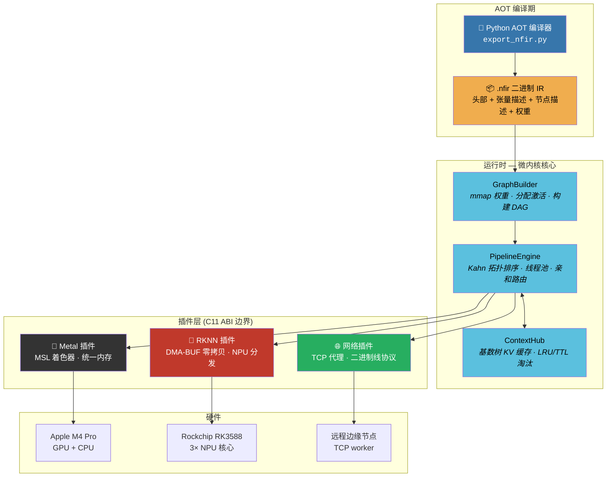

<p align="center">
  <h1 align="center">⚡️ NeuroFabric</h1>
  <p align="center">
    <strong>面向边缘 AI 的微内核异构推理框架</strong><br/>
    <em>零虚表 ABI · 真零拷贝 DMA-BUF · DAG 调度 · 分布式边云协同</em>
  </p>
</p>

<p align="center">
  
  
  
  
  
  
  
  
</p>

<p align="center">
  <a href="README_EN.md">English</a> | <strong>中文</strong>
</p>

---

## 为什么选择 NeuroFabric？

大多数推理框架把运行时做成铁板一块——绑死一个厂商 SDK、一种内存模型、一套执行拓扑。NeuroFabric 反其道而行：一个只管调度契约的**微内核**，所有计算、内存、传输全部委托给**动态加载的插件**，插件之间通过**零虚表 C11 ABI 边界**通信。

效果：同一个二进制文件，在 Mac 上调度 Apple Metal GPU shader，在 RK3588 上走 NPU DMA-BUF 零拷贝推理——或者两者同时通过 TCP 协作，DAG 调度器自动把子图路由到最优加速器。

---

## 核心设计哲学

### 🔩 零虚表沙漏型 ABI

所有跨边界调用走**纯 C 函数指针表**——没有 vtable，没有 RTTI，没有 `dynamic_cast`。核心库导出**零个符号**。插件在加载时填充 `nf_provider_vtable` 结构体，ABI 版本门控在第一个字节分发前就拒绝不兼容的插件。这意味着你可以把 RKNN 插件换成 TensorRT 插件，而无需重编译调度器、内存管理器或任何其他插件。

### 🧠 数据驱动执行：`.nfir` IR

模型由 Python AOT 编译器离线编译为紧凑的二进制 IR（`.nfir`）。C++ 运行时从不硬编码张量形状、算子名称或图拓扑——它只是 `mmap` 权重载荷（64B SIMD 对齐，4KB 页对齐）并遍历节点描述符。新增一个模型只需一次 Python 调用，零 C++ 改动，零重编译。

### ⚡ 真零拷贝内存路径

RK3588 上：`rknn_create_mem()` → CMA DMA-BUF fd → `rknn_set_io_mem()` → NPU 直接从 CMA 读取，没有 `memcpy`。Apple Silicon 上：统一内存意味着 GPU 看到的虚拟地址和 CPU 一样。缓冲区抽象（`nf_buffer_ops`）将这些隐藏在统一的 `map`/`unmap`/`cache_sync` 接口之后，带有显式脏标记（`cpu_dirty` / `dev_dirty`）。

**实测**：YOLOv5s 在 RK3588 NPU 上——零拷贝 **23.12ms** vs 拷贝模式 63.48ms（**2.7 倍加速**）。

### 🌐 分布式 DAG 调度

计算图中任意节点可标记为 `NF_TASK_REMOTE`，调度器透明地通过 TCP 路由到远程 worker（例如 Mac 协调器 → Rock 5B+ 边缘 NPU）。线协议是最小化的二进制帧（40B 头 + 逐张量描述符 + 256KB 分块原始载荷，CRC32C 完整性校验）。没有 Protobuf，没有 gRPC，只有原始 socket 和确定性帧格式。

---

## 架构



### 内存架构

```
┌─────────────────────────────────────────────────────────┐
│                   nf_buffer (不透明句柄)                  │
│                   nf_buffer_ops (C 函数指针虚表)           │
├──────────┬──────────┬──────────┬──────────┬─────────────┤
│   CPU    │  统一    │ DMA-BUF  │  MMAP    │   外部      │
│ malloc() │  Apple   │ RK3588   │  权重    │ Vulkan/EGL  │
│          │  一致性  │ CMA fd   │  只读    │             │
├──────────┴──────────┴──────────┴──────────┴─────────────┤
│  cache_sync: flush (CPU→设备) / invalidate (设备→CPU)    │
│  Apple: 空操作 (硬件一致性)  RK3588: DMA_BUF_IOCTL_SYNC  │
└─────────────────────────────────────────────────────────┘
```

---

## 构建与安装

### 前置条件

| 平台 | 工具链 | SDK |
|------|--------|-----|
| macOS (Apple Silicon) | Xcode CLT / clang 15+ | Metal (系统自带) |
| Rock 5B+ (RK3588) | GCC 12+ / aarch64 | [RKNN Toolkit2](https://github.com/airockchip/rknn-toolkit2) `librknnrt.so` + `rknn_api.h` |
| Linux x86_64 | GCC 12+ / clang 15+ | (仿真模式，无加速器) |

### 方案 A：Apple Silicon (macOS)

```bash
git clone https://github.com/anthropics/neurofabric.git
cd neurofabric

# arm64 macOS 自动检测 Metal 插件
cmake -B build -DCMAKE_BUILD_TYPE=Release
cmake --build build -j$(sysctl -n hw.ncpu)
ctest --test-dir build --output-on-failure    # 8/8 通过
```

### 方案 B：Rock 5B+ (RK3588) — 本机编译

```bash
# 在 Rock 5B+ 上 (Debian/Ubuntu aarch64)
# 确保 RKNN 运行时已安装：
#   /usr/lib/librknnrt.so
#   /usr/include/rknn_api.h

cmake -B build \
  -DCMAKE_BUILD_TYPE=Release \
  -DNF_PLUGIN_RKNN=ON
cmake --build build -j$(nproc)
ctest --test-dir build --output-on-failure    # 8/8 通过
```

### 方案 C：交叉编译 RK3588 (从 x86_64 主机)

```bash
cmake -B build \
  -DCMAKE_TOOLCHAIN_FILE=/path/to/aarch64-linux-gnu.cmake \
  -DCMAKE_BUILD_TYPE=Release \
  -DNF_PLUGIN_RKNN=ON \
  -DRKNN_RT=/path/to/librknnrt.so
cmake --build build -j$(nproc)
```

### 构建选项

| 选项 | 默认值 | 说明 |
|------|--------|------|
| `NF_BUILD_TESTS` | `ON` | 构建单元测试 |
| `NF_BUILD_TOOLS` | `ON` | 构建 `nf_node_cli` |
| `NF_PLUGIN_METAL` | 自动 | Apple Silicon → ON |
| `NF_PLUGIN_RKNN` | 自动 | Linux aarch64 → ON |
| `NF_PLUGIN_NETWORK` | `ON` | TCP 分布式传输 |

---

## 快速开始

### 1. 将模型编译为 `.nfir`

```python
from nf_compiler.export_nfir import NfirBuilder, NF_DTYPE_F32, NF_IR_USAGE_WEIGHT, NF_IR_USAGE_ACTIVATION
import numpy as np

builder = NfirBuilder()
weights = np.random.randn(1, 3, 640, 640).astype(np.float32)

builder.add_tensor(0, NF_DTYPE_F32, weights.shape, NF_IR_USAGE_WEIGHT, weight_data=weights)
builder.add_tensor(1, NF_DTYPE_F32, (1, 3, 640, 640), NF_IR_USAGE_ACTIVATION)
builder.add_tensor(2, NF_DTYPE_F32, (1, 80, 8400), NF_IR_USAGE_ACTIVATION)
builder.add_node(0, "yolov5_detect", [0, 1], [2])
builder.build("yolov5s.nfir")
```

### 2. 本地运行

```bash
./build/bin/nf_node_cli --mode=local --nfir=yolov5s.nfir
```

### 3. 分布式：协调器 + 边缘 worker

```bash
# 在 Rock 5B+ 上 (边缘 NPU worker)：
./nf_node_cli --mode=worker --port=9999

# 在 Mac 上 (协调器)：
./nf_node_cli --mode=coord --nfir=model.nfir --remote=192.168.1.70:9999
```

### 4. C++ API (编程接口)

```cpp
#include <neurofabric/PipelineEngine.hpp>
#include <neurofabric/GraphBuilder.hpp>

nf::PipelineEngine engine;

// 注册 provider (从插件加载)
engine.register_provider(provider, vtable, NF_AFFINITY_NPU);

// 加载 .nfir → 构建 DAG → 执行
nf::GraphBuilder builder(engine, my_alloc_fn);
builder.load("model.nfir");

uint32_t graph_id;
builder.build(&graph_id);

auto future = engine.submit(graph_id);
nf_status result = future.get();  // 阻塞直到 DAG 完成
```

---

## 性能

| 模型 | 平台 | 后端 | 分辨率 | 延迟 | 内存路径 |
|------|------|------|--------|------|----------|
| YOLOv5s | Rock 5B+ (RK3588) | NPU × 3 核 | 640×640 | **23.12 ms** | 零拷贝 DMA-BUF |
| YOLOv5s | Rock 5B+ (RK3588) | NPU (拷贝模式) | 640×640 | 63.48 ms | memcpy 回退 |
| vector_add (1M) | Mac M4 Pro | Metal GPU | — | < 0.5 ms | 统一内存 |
| attention_prefill | Mac M4 Pro | Metal GPU | 128 tokens | < 1 ms | 统一内存 |
| NFIR E2E (1024 floats) | 双平台 | CPU mock | — | < 1 ms | mmap 权重 |

> 零拷贝 DMA-BUF 在相同硬件和模型上实现了 **2.7 倍加速**。

---

## 测试套件

所有 8 个测试在 macOS (M4 Pro) 和 Linux (Rock 5B+ RK3588) 上均通过，零警告：

| 测试 | 验证内容 |
|------|----------|
| `nf_smoke_test` | 插件加载/卸载，ABI 版本门控 |
| `nf_buffer_test` | 缓冲区分配/映射/解映射，缓存一致性操作 |
| `nf_scheduler_test` | DAG 拓扑排序，工作窃取，亲和路由 |
| `nf_e2e_pipeline_test` | 完整 DAG + TCP 回环，逐位验证 |
| `nf_split_inference_test` | Metal 预填充 → TCP → 解码，KV 缓存交接 |
| `nf_ir_loader_test` | `.nfir` 生成，mmap 权重，DAG 执行 |
| `nf_silicon_test` | 真实 Metal GPU：vector_add + attention 内核 |
| `nf_rknn_silicon_test` | 真实 NPU：零拷贝 DMA-BUF + YOLOv5s 推理 |
| `nf_nfir_e2e_test` | `.nfir` → GraphBuilder → PipelineEngine → 验证 |

```bash
ctest --test-dir build --output-on-failure
```

---

## 项目结构

```
neurofabric/
├── core/
│   ├── include/neurofabric/
│   │   ├── neuro_fabric_abi.h          # 不透明句柄、状态码、provider 虚表
│   │   ├── neuro_buffer_abi.h          # 缓冲区操作、缓存一致性、张量描述符
│   │   ├── neuro_scheduler_abi.h       # DAG 任务图、调度器虚表、亲和性
│   │   ├── neuro_network_protocol.h    # 线协议、布局标签、CRC32C 帧
│   │   ├── neuro_ir_format.h           # .nfir 二进制 IR 格式 (40B 头 + 描述符)
│   │   ├── PipelineEngine.hpp          # Kahn 拓扑排序 DAG 调度器 + 线程池
│   │   ├── ContextHub.hpp              # 基数树前缀匹配 KV 缓存
│   │   ├── TensorView.hpp             # C++20 RAII 张量包装器
│   │   └── GraphBuilder.hpp            # IR 驱动的 DAG 构建器
│   └── src/
│       ├── plugin_loader.cpp           # dlopen + ABI 版本门控
│       ├── platform/                   # dl_posix.cpp, dl_win32.cpp
│       └── graph/                      # GraphBuilder.cpp, mmap_buffer.cpp
├── plugins/
│   ├── metal/src/metal_provider.mm     # Apple Metal GPU (MSL 着色器, 统一内存)
│   ├── rknn/src/rknn_provider.cpp      # RK3588 NPU (DMA-BUF 零拷贝, 子图闭包)
│   └── network/src/                    # TCP 代理 (256KB 分块, CRC32C)
├── tools/
│   ├── nf_node_cli.cpp                 # 通用 CLI：本地 / 协调 / worker
│   └── nf_compiler/
│       ├── export_nfir.py              # Python AOT 编译器 (stdlib + numpy)
│       └── test_export.py              # 编译器单元测试 (6/6)
└── tests/                              # 8 个集成 + 单元测试
```

---

## 路线图

- [ ] **INT8 量化流水线** — 校准数据集 → 逐通道 scale/zp → RKNN INT8 模型导出
- [ ] **多 Worker 负载均衡** — 基于延迟感知的路由 + 心跳健康检查
- [ ] **性能分析与追踪** — 逐算子计时、内存水位热力图、Chrome `trace_event` 导出
- [ ] **动态批处理** — 请求合并，可配置最大等待时间 / 最大批大小
- [ ] **Vulkan 计算插件** — SPIR-V 着色器分发，面向 Android / Linux 桌面 GPU
- [ ] **ONNX → .nfir 前端** — AOT 编译器直接导入 ONNX 图，算子融合 pass

---

## 设计决策与注意事项

<details>
<summary>点击展开 — 贡献者须知</summary>

- **跨动态库桥接**：插件通过 `offsetof(nf_task_desc, inputs)` 从缓冲区指针恢复 `nf_task_desc`。不要重排该结构体。
- **RKNN 命名**：SDK 导出 `rknn_init` — 我们的 provider 使用 `rknn_prov_init` / `rknn_prov_shutdown` 避免冲突。
- **DMA-BUF 生命周期**：对 `FROM_FD` 内存调用 `rknn_destroy_mem` 只释放包装结构体，不释放 fd/VA。分配上下文拥有 fd。
- **零拷贝强制**：如果任何 IO 缓冲区缺少 `sdk_mem`，分发触发 `FATAL` — 不会静默回退到拷贝模式。
- **macOS 页大小**：arm64 macOS 使用 16KB 页。mmap 偏移必须对齐到 `sysconf(_SC_PAGESIZE)`，而非硬编码 4KB。
- **Linux socket**：每次 `send()` 都需要 `signal(SIGPIPE, SIG_IGN)` + `MSG_NOSIGNAL` — 否则断开的管道会杀死进程。
- **C/C++ 双头文件**：C++ 中使用 `static_assert`，C 中使用 `_Static_assert`（GCC 12 兼容）。通过 `__cplusplus` 守卫。
- **Release 构建**：测试使用 `CHECK()` 宏，而非 `assert()` — `NDEBUG` 在 Release 模式下会剥离 `assert`。

</details>

---

## 许可证

本项目基于 [Apache License 2.0](LICENSE) 开源。

```
Copyright 2025 NeuroFabric Contributors

Licensed under the Apache License, Version 2.0 (the "License");
you may not use this file except in compliance with the License.
You may obtain a copy of the License at

    http://www.apache.org/licenses/LICENSE-2.0

Unless required by applicable law or agreed to in writing, software
distributed under the License is distributed on an "AS IS" BASIS,
WITHOUT WARRANTIES OR CONDITIONS OF ANY KIND, either express or implied.
See the License for the specific language governing permissions and
limitations under the License.
```

---

<p align="center">
  <sub>以对内存布局、ABI 稳定性的极致关注构建，坚信推理框架应以微秒而非抽象来衡量。</sub>
</p>
