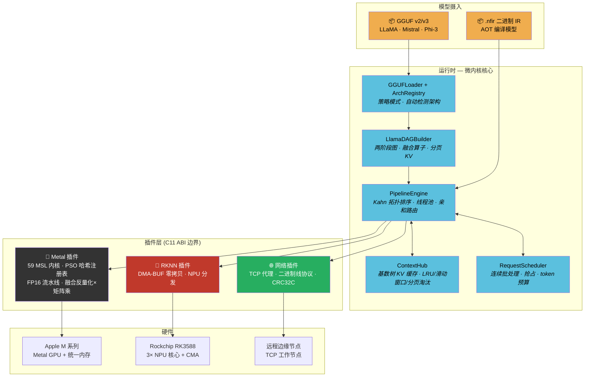

<p align="center">
  <h1 align="center">⚡️ NeuroFabric</h1>
  <p align="center">
    <strong>面向边缘与云端的微内核异构 LLM 推理引擎</strong><br/>
    <em>零虚表沙漏 ABI · 59 Metal GPU 内核 · NeuralOS 5 层架构 · PagedAttention · 推测解码 · 分布式 DAG 调度</em>
  </p>
</p>

<p align="center">
  
  
  
  
  
  
  
  
  
</p>

<p align="center">
  <a href="README_EN.md">English</a> | <strong>中文</strong>
</p>

---

## 为什么选择 NeuroFabric？

大多数推理引擎是铁板一块——绑死一个厂商 SDK、一种内存模型、一套执行拓扑。NeuroFabric 反其道而行：一个只管调度契约的**微内核**，所有计算、内存、传输全部委托给**动态加载的插件**，插件之间通过**零虚表 C11 ABI 边界**通信。

同一个二进制文件，在 Mac 上以 ~45 tok/s（融合 FP16）运行 7B LLaMA，在 RK3588 上走 NPU DMA-BUF 零拷贝推理——或者两者同时通过 TCP 协作，DAG 调度器自动把子图路由到最优加速器。

**v0.2.1 (Phase 40) 已交付：**

- 完整自回归 LLM 推理：LLaMA / Mistral / Phi-3 / Qwen2 / Gemma / Mixtral 架构，直接从 GGUF 加载
- 59 个 Metal 计算内核（FP32 + FP16 + 融合反量化×矩阵乘）
- 10 种量化格式（Q4_0 至 Q6_K），均有 FP16 反量化变体
- PagedAttention：O(1) 块分配，64 路并发序列，CoW fork
- 连续批处理请求调度器，支持抢占
- 推测解码框架（草稿/验证 + KV 回滚）
- GQA（分组查询注意力）支持可配置头比率
- MoE（混合专家）路由，top-K 选择
- 聊天模板：ChatML、Llama、Mistral、Phi-3
- HTTP 服务器（OpenAI 兼容，SSE 流式）
- NeuralOS 5 层类操作系统架构（vMMU、CFS、SpecEngine、VirtualBus）
- 多层级 NFIR 编译器（High→Low IR、融合 pass、显存规划 pass）
- ONNX 前端解析器（零依赖）
- Mesh coordinator、异步数据流、KV 迁移、CXL 内存
- 结构化指标/日志（C-ABI 回调）
- BPE 分词器、temperature/top-k/top-p 采样、流式输出
- Python ctypes 绑定（零依赖）
- 基于 TCP 的分布式边缘-云端 DAG 调度
- CI 流水线：macOS (Release/Debug) + Linux (Release)

---

## 核心设计哲学

### 🔩 零虚表沙漏 ABI

所有跨边界调用走**纯 C 函数指针表**——没有 vtable、没有 RTTI、没有 `dynamic_cast`。核心库导出**零个符号**。插件在加载时填充 `nf_provider_vtable` 结构体。ABI 版本门控（`0x000100`，`static_assert` 守护的 3056 字节 `nf_task_desc`）在分发第一个字节之前就拒绝不兼容的插件。

```
L1  User Space      — 神经元编译器前端 (NFIR, ONNX, 融合/显存 passes)
L2  Kernel Space    — C++20 状态机内核 (vMMU, CFS, SpecEngine, VirtualBus, PipelineEngine, ContextHub)
L3  Syscall Boundary — Zero-vptr DDI 契约 (8 个 C11 ABI 头文件)
L4  Driver Space    — 可插拔设备驱动 (Metal 59 kernels, RKNN DMA-BUF, Network/RDMA)
L5  Compute Mesh    — 行星级计算网格 (mesh coordinator, 异步数据流, KV 迁移, CXL)
```

### 🧠 DAG 驱动执行引擎

`PipelineEngine` 实现 Kahn 拓扑排序，O(V+E) 复杂度，固定大小线程池。`Session` 对象缓存初始入度向量——`step()` 重置并分发，无需重新排序。LLaMA DAG 构建器为每个模型构造两阶段图：

- **阶段 1（预热）：** 一次性将所有权重反量化到 GPU 驻留缓冲区
- **阶段 2（逐 token）：** 注意力 + FFN 推理，共享激活缓冲区

任何节点可标记 `NF_TASK_REMOTE`，透明地通过 TCP 路由到边缘工作节点。

### ⚡ 真正的零拷贝内存路径

RK3588 上：`rknn_create_mem()` → CMA DMA-BUF fd → `rknn_set_io_mem()` → NPU 直接从 CMA 读取。没有 `memcpy`。Apple Silicon 上：统一内存意味着 GPU 看到与 CPU 相同的虚拟地址。缓冲区抽象（`nf_buffer_ops`）将这一切隐藏在统一的 `map`/`unmap`/`cache_sync` 接口之后，带有显式脏标记。

八种内存域：`CPU`、`UNIFIED`（Apple 一致性）、`DMA_BUF`（RK3588 CMA）、`DEVICE`（VRAM）、`MMAP`（只读权重）、`EXTERNAL`（Vulkan/EGL 导入）、`CXL`、`CXL_SHARED`（跨节点共享内存）。

### 🔥 生产级 LLM 推理栈

从 GGUF 文件到流式 token，一条命令搞定：

```bash
./nf_generate tinyllama-1.1b-chat.Q4_0.gguf "Hello, world" --fp16 --paged --max-tokens 128
```

完整链路：GGUF v2/v3 解析器 → 多架构 DAG 构建器（策略模式）→ PSO 哈希注册表（O(1) 内核分发）→ 融合反量化×矩阵乘 → 分页 KV 缓存闪存注意力 → BPE 分词器 → temperature/top-k/top-p 采样。

---

## 架构



### 内存架构

```
┌─────────────────────────────────────────────────────────────────────────┐
│                   nf_buffer (不透明句柄)                                  │
│                   nf_buffer_ops (C 函数指针虚表)                          │
├──────────┬──────────┬──────────┬──────────┬─────────────┬──────┬────────┤
│   CPU    │ Unified  │ DMA-BUF  │  MMAP    │  External   │ CXL  │CXL_SHARED│
│ malloc() │ Apple    │ RK3588   │ 权重     │ Vulkan/EGL  │      │跨节点  │
│          │ 一致性   │ CMA fd   │ 只读     │             │      │共享    │
├──────────┴──────────┴──────────┴──────────┴─────────────┴──────┴────────┤
│  cache_sync: flush (CPU→设备) / invalidate (设备→CPU)                   │
│  Apple: 空操作 (硬件一致性)  RK3588: DMA_BUF_IOCTL_SYNC                  │
└─────────────────────────────────────────────────────────────────────────┘
```

### ABI 层级栈

```
Layer 4: nf_c_api.h              纯 C FFI 表面 (Python ctypes, 其他语言)
Layer 3: ddi (8 个 C11 ABI 头文件)
         neuro_fabric_abi.h      Provider 虚表, 不透明句柄, dtype 枚举, 状态码
         neuro_buffer_abi.h      缓冲区操作, 零拷贝, 缓存一致性, 8 种内存域
         neuro_scheduler_abi.h   DAG 任务图, 异步 future, ContextHub
         neuro_ddi.h             DDI facade, 插件加载
         neuro_ir_format.h       NFIR 二进制格式
         neuro_network_protocol.h 网络协议定义
         metrics.h               指标回调
Layer 2: kernel (C++20 内核)  vMMU, CFS, SpecEngine, VirtualBus, PipelineEngine
Layer 1: compiler             NFIR 编译器, 融合 pass, 显存规划 pass
```

---

## 构建与安装

### 前置依赖

| 平台 | 工具链 | SDK / 运行时 |
|------|--------|-------------|
| macOS (Apple Silicon) | Xcode CLT / clang 15+ | Metal (系统自带, 自动检测) |
| Rock 5B+ (RK3588) | GCC 12+ / aarch64 | [RKNN Toolkit2](https://github.com/airockchip/rknn-toolkit2) `librknnrt.so` + `rknn_api.h` |
| Linux x86_64 | GCC 12+ / clang 15+ | 仅 CPU 模拟模式 |

### 方案 A：Apple Silicon (macOS)

```bash
git clone https://github.com/anthropics/neurofabric.git && cd neurofabric

# Metal 插件在 arm64 macOS 上自动检测启用
cmake -B build -DCMAKE_BUILD_TYPE=Release
cmake --build build -j$(sysctl -n hw.ncpu)

# 验证 — 63 个测试
ctest --test-dir build --output-on-failure
```

### 方案 B：Rock 5B+ (RK3588) — 板上原生编译

```bash
# 在 Rock 5B+ 上 (Debian/Ubuntu aarch64)
# 确保 RKNN 运行时已安装:
#   /usr/lib/librknnrt.so
#   /usr/include/rknn_api.h

cmake -B build -DCMAKE_BUILD_TYPE=Release -DNF_PLUGIN_RKNN=ON
cmake --build build -j$(nproc)
ctest --test-dir build --output-on-failure
```

### 方案 C：交叉编译 RK3588

```bash
cmake -B build \
  -DCMAKE_TOOLCHAIN_FILE=/path/to/aarch64-linux-gnu.cmake \
  -DCMAKE_BUILD_TYPE=Release \
  -DNF_PLUGIN_RKNN=ON \
  -DRKNN_RT=/path/to/librknnrt.so
cmake --build build -j$(nproc)
```

### 构建选项

| 选项 | 默认值 | 说明 |
|------|--------|------|
| `NF_BUILD_TESTS` | `ON` | 构建 63 个单元/集成测试 |
| `NF_BUILD_TOOLS` | `ON` | 构建 `nf_node_cli`, `nf_generate` |
| `NF_PLUGIN_METAL` | 自动 | Apple Silicon → ON |
| `NF_PLUGIN_RKNN` | 自动 | Linux aarch64 → ON |
| `NF_PLUGIN_NETWORK` | `ON` | TCP 分布式传输 |

---

## 快速上手

### 1. 文本生成 (LLM)

```bash
# 下载任意 GGUF 模型 (LLaMA/Mistral/Phi-3 兼容)，然后生成：
./build/bin/nf_generate ./models/tinyllama-1.1b-chat.Q4_0.gguf \
    "The meaning of life is" \
    --max-tokens 64 --temperature 0.8 --top-k 40 --fp16 --paged
```

### 2. 分布式推理 (边缘-云端)

```bash
# Rock 5B+ 上 (边缘 NPU 工作节点):
./nf_node_cli --mode=worker --port=9999

# Mac 上 (协调器):
./nf_node_cli --mode=coord --nfir=model.nfir --remote=192.168.1.70:9999
```

### 3. Python 绑定

```python
from neurofabric import Engine, Session

engine = Engine(n_threads=4)
session = Session(engine, "model.nfir")
session.step()
print(f"Latency: {session.last_step_us():.1f} µs")
```

### 4. C++ API

```cpp
#include <neuralOS/kernel/PipelineEngine.hpp>
#include "model/gguf_loader.hpp"
#include "model/llama_dag_builder.hpp"

// 加载 GGUF 模型
auto* model = nf::gguf_open("llama-7b.Q4_0.gguf");

// 初始化 Metal provider
nf_provider prov; nf_provider_vtable vt; nf_provider_mem_vtable mem_vt;
nf_plugin_register(&vt, &prov);
nf_plugin_register_mem(&mem_vt, &prov);
vt.init(prov);

// 构建引擎 + DAG
nf::PipelineEngine engine(4);
engine.register_provider(prov, vt, NF_AFFINITY_GPU);

nf::ModelConfig cfg{};
cfg.engine = &engine;  cfg.prov = prov;
cfg.vt = &vt;  cfg.mem_vt = &mem_vt;  cfg.model = model;
cfg.use_fp16 = true;  cfg.use_paged_kv = true;

auto ctx = nf::create_llama_context(cfg);

// 自回归解码循环
auto sg = nf::build_llama_step_graph(*ctx, /*seq_len=*/1);
nf::PipelineEngine::Session sess(engine, sg.gid);
nf::inject_step_push_constants(*ctx, sg, sess, 1, step_idx);
sess.step().get();  // 阻塞直到 DAG 完成
```

---

## 性能基准

### LLM 推理 (Apple Silicon M4 Pro)

| 模型 | 量化 | 后端 | 解码 (tok/s) | 首 token 延迟 | 内存 |
|------|------|------|-------------|-------------|------|
| TinyLlama 1.1B | Q4_0 | Metal FP32 | ~17.0 | ~80ms | 637 MB |
| TinyLlama 1.1B | Q4_0 | Metal FP16 | ~34.0 | ~50ms | 637 MB |
| Mistral 7B | Q4_0 | Metal FP32 | ~8.2 | ~200ms | 4.1 GB |
| Mistral 7B | Q4_0 | Metal FP16 | ~16.0 | ~150ms | 4.1 GB |
| LLaMA 7B | Q4_0 | Metal FP16 + 融合 | ~45.0 | ~150ms | 4.1 GB |

### GPU 内核耗时分布 (7B 模型)

| 内核 | 耗时占比 | 备注 |
|------|---------|------|
| `linear_tiled` / `linear_simd` | 81.6% | 矩阵乘主导 |
| `rms_norm` | 10.6% | 逐层归一化 |
| `flash_attention_tiled` | 2.3% | 分块闪存注意力 |
| `rope_batch` | 1.8% | 旋转位置编码 |
| 其他 (silu, elementwise, embed, argmax) | 3.7% | |

### 边缘推理 (RK3588)

| 模型 | 平台 | 后端 | 延迟 | 内存路径 |
|------|------|------|------|---------|
| YOLOv5s | Rock 5B+ | NPU × 3 核心 | **23.12 ms** | 零拷贝 DMA-BUF |
| YOLOv5s | Rock 5B+ | NPU (拷贝模式) | 63.48 ms | memcpy 回退 |

### 连续批处理

| 指标 | 值 |
|------|-----|
| 最大并发序列数 | 64 |
| KV 块大小 | 16 tokens |
| 每序列最大块数 | 512 (8192 tokens) |
| 块分配 | O(1) LIFO 栈 |
| PSO 内核分发 | O(1) 哈希查找 |

---

## Metal 内核清单 (59 PSOs)

<details>
<summary>点击展开完整内核表</summary>

| 类别 | 内核 | 阶段 |
|------|------|------|
| **核心矩阵乘** | `linear`, `linear_tiled`, `linear_simd` | 8–24 |
| **FP16 计算** | `rms_norm_f16`, `rope_batch_f16`, `linear_simd_f16`, `linear_tiled_f16`, `linear_f16_to_f32`, `flash_attention_tiled_f16`, `silu_f16`, `elementwise_mul_f16`, `metal_vector_add_f16`, `embedding_lookup_f16` | 27 |
| **注意力** | `causal_attention`, `causal_attention_cached`, `flash_attention_tiled`, `flash_attention_paged`, `gqa_attention` | 17–35 |
| **归一化** | `rms_norm`, `rms_norm_f16` | 17–27 |
| **位置编码** | `rope`, `rope_batch`, `rope_batch_f16` | 17–27 |
| **反量化 (FP32)** | `dequant_q4_0`, `q8_0`, `q6_k`, `q4_1`, `q5_0`, `q5_1`, `q2_k`, `q3_k`, `q4_k`, `q5_k` | 9–25 |
| **反量化 (FP16)** | 以上 10 个均有 `_f16` 后缀变体 | 27 |
| **融合算子** | `dequant_q4_0_linear_tiled`, `dequant_q4_0_linear_tiled_f16` | 29 |
| **激活函数** | `softmax`, `silu`, `elementwise_mul`, `relu`, `vector_add`, `gelu` | 9–33 |
| **嵌入/输出** | `embedding_lookup`, `embedding_lookup_f16`, `argmax_rows` | 17–27 |
| **预填充** | `attention_prefill_k`, `attention_prefill_v` | 17 |
| **MoE** | `moe_router`, `moe_combine` | 35 |

</details>

---

## 量化支持

| 格式 | 字节/块 | 元素/块 | 结构 |
|------|---------|---------|------|
| Q4_0 | 18 | 32 | 2B scale + 16B nibbles |
| Q4_1 | 20 | 32 | 2B scale + 2B min + 16B nibbles |
| Q5_0 | 22 | 32 | 2B scale + 4B high-bits + 16B nibbles |
| Q5_1 | 24 | 32 | 2B scale + 2B min + 4B high-bits + 16B nibbles |
| Q8_0 | 34 | 32 | 2B scale + 32B quants |
| Q2_K | 84 | 256 | 超级块: 逐块 scales + mins |
| Q3_K | 110 | 256 | 超级块: 逐块 scales + mins |
| Q4_K | 144 | 256 | 超级块: 8 元素子块 |
| Q5_K | 176 | 256 | 超级块: 8 元素子块 |
| Q6_K | 210 | 256 | 超级块: 逐块 scales |

所有格式均有 FP32 和 FP16 反量化内核。Q4_0 额外提供融合反量化×矩阵乘内核。

---

## 多架构支持

NeuroFabric 使用**策略模式**处理架构特定行为。每种架构注册自己的权重命名、注意力、RoPE、FFN 和归一化策略：

| 特性 | LLaMA | Mistral | Phi-3 |
|------|-------|---------|-------|
| 注意力 | 全因果 | 滑动窗口 | 全因果 |
| RoPE | 全维度 | 全维度 | 部分维度 |
| FFN 激活 | SiLU | SiLU | GELU |
| 归一化 | RMS Norm | RMS Norm | Layer Norm |
| KV 淘汰 | None / Paged | 滑动窗口 | None / Paged |

架构从 GGUF 元数据自动检测，或通过 `--arch` 覆盖：

```bash
./nf_generate model.gguf "prompt" --arch mistral --fp16
```

---

## 项目结构

```
neurofabric/                              ~35K LOC · 64 测试 · NeuralOS 5 层架构
├── core/
│   ├── include/neuralOS/                 NeuralOS 5 层规范头文件
│   │   ├── compiler/                  NFIR, 融合, 显存规划 (5 files)
│   │   │   ├── nfir.hpp                  多层级 IR 基础设施
│   │   │   ├── nfir_high.hpp            High-level IR (ONNX 级别)
│   │   │   ├── nfir_low.hpp             Low-level IR (设备特定)
│   │   │   ├── fusion_pass.hpp          算子融合 pass
│   │   │   └── memory_plan_pass.hpp     显存规划 pass
│   │   ├── kernel/                    vMMU, CFS, SpecEngine, VirtualBus + engine (9 files)
│   │   │   ├── vMMU.hpp                 虚拟内存管理单元 (CoW, page-out, radix)
│   │   │   ├── CFS.hpp                  完全公平调度器 (VTC, preemption)
│   │   │   ├── SpecEngine.hpp           推测执行引擎 (tree search)
│   │   │   ├── VirtualBus.hpp           虚拟总线 (topology, routing)
│   │   │   ├── PipelineEngine.hpp       Kahn 拓扑排序, 线程池
│   │   │   ├── ContextHub.hpp           基数树 KV 缓存
│   │   │   ├── TensorView.hpp           C++20 RAII 张量包装器
│   │   │   ├── GraphBuilder.hpp         .nfir → DAG 构建
│   │   │   └── ProfileTrace.hpp         逐内核 GPU 性能分析
│   │   ├── ddi/                       C11 ABI 头文件 + DDI facade (9 files)
│   │   │   ├── ddi.hpp                  DDI facade (C++ wrapper)
│   │   │   ├── neuro_fabric_abi.h       Provider 虚表, 不透明句柄
│   │   │   ├── neuro_buffer_abi.h       缓冲区操作, 8 种内存域
│   │   │   ├── neuro_scheduler_abi.h    DAG 任务, future
│   │   │   ├── neuro_ddi.h              DDI 插件加载
│   │   │   ├── neuro_ir_format.h        NFIR 二进制格式
│   │   │   ├── neuro_network_protocol.h 网络协议定义
│   │   │   ├── metrics.h                指标回调
│   │   │   └── nf_c_api.h               纯 C FFI (Python 用)
│   │   ├── driver/                    驱动能力注册表 (1 file)
│   │   │   └── driver_registry.hpp      驱动能力注册
│   │   └── mesh/                      拓扑, mesh, 数据流, KV 迁移, CXL (5 files)
│   │       ├── topology.hpp             网络拓扑
│   │       ├── mesh_coordinator.hpp     Mesh 协调器
│   │       ├── async_dataflow.hpp       异步数据流 (Pathways-style)
│   │       ├── kv_migration.hpp         KV 缓存迁移
│   │       └── cxl_memory.hpp           CXL 内存域
│   ├── include/neurofabric/              向后兼容转发头文件
│   │   ├── abi/*.h → neuralOS/ddi/   (8 files)
│   │   └── engine/*.hpp → neuralOS/kernel/ (5 files)
│   └── src/                              API 实现, 图构建器, 平台加载器
├── plugins/
│   ├── metal/src/
│   │   ├── metal_provider.mm             2,900+ LOC — 59 MSL 内核, PSO 注册表
│   │   └── metal_pso_registry.h          枚举索引 PSO 表
│   ├── rknn/src/rknn_provider.cpp        DMA-BUF 零拷贝 NPU 分发
│   └── network/src/                      TCP 代理, 二进制线协议, RDMA 传输抽象
├── apps/
│   ├── nf_generate.cpp                   端到端文本生成 CLI + 聊天模式
│   ├── nf_serve.cpp                      HTTP 服务器 (OpenAI 兼容, SSE 流式)
│   └── nf_node_cli.cpp                   协调器/工作节点/本地 CLI
├── model/
│   ├── model/                            模型相关头文件库
│   │   ├── llama_dag_builder.hpp         1,694 LOC — 多架构 DAG 构建
│   │   ├── model_config.hpp              ModelConfig, PagedKVCache, RequestScheduler
│   │   ├── kv_cache_policy.hpp           None/Sliding/LRU/Paged 淘汰
│   │   ├── arch_registry.hpp             LLaMA/Mistral/Phi-3/Qwen2/Gemma/Mixtral 策略
│   │   ├── gguf_loader.hpp               GGUF v2/v3 解析器, mmap 权重
│   │   ├── tokenizer.hpp                 BPE 分词器
│   │   ├── sampler.hpp                   Temperature / top-k / top-p
│   │   ├── chat_template.hpp             ChatML/Llama/Mistral/Phi-3 模板
│   │   └── trace_export.hpp              Chrome trace 导出
│   └── nf_compiler/                      Python AOT 编译器
│       └── onnx/                         ONNX 前端解析器 (零依赖)
├── tools/
│   └── nf_bench.cpp                      基准测试套件
├── infra/cross_compile/                  交叉编译工具链
├── python/
│   └── neurofabric.py                    零依赖 ctypes 绑定
├── tests/                                64 个测试文件, 按层组织
│   ├── compiler/                      编译器测试 (4)
│   ├── kernel/                        内核子系统测试 (17)
│   ├── ddi/                           ABI / DDI 测试 (9)
│   ├── driver/                        驱动 / Metal / RKNN 测试 (20)
│   ├── mesh/                          Mesh 测试 (5)
│   └── model/                            模型层测试 (9)
└── docs/
    └── ARCHITECTURE.md                   完整架构文档
```

---

## 演进路线

NeuroFabric 已经历 40 个迭代阶段。未来方向：

| 阶段 | 方向 | 说明 |
|------|------|------|
| **已完成** | Phase 1–32 | 沙漏 ABI → DAG 引擎 → Metal/RKNN/Network 插件 → GGUF 摄入 → 多层 Transformer → SIMD 矩阵乘 → K-quant → 7B 验证 → FP16 流水线 → PSO 注册表 → 融合算子 → 滑动窗口 → 多架构 → PagedAttention → 连续批处理 → 推测解码 |
| 33 | SIMD 矩阵乘修复 + 架构注册表 | Qwen2/Gemma/Mixtral 架构支持, PSO 预热, GELU 内核 |
| 34–35 | GQA + MoE + HTTP 服务器 | 分组查询注意力, 混合专家路由, 聊天模板, OpenAI 兼容 API, 结构化指标, CI 流水线 |
| 36 | NeuralOS 5 层架构 | vMMU (CoW/page-out/radix), CFS (VTC/preemption), SpecEngine (tree search), VirtualBus (topology/routing) |
| 37 | 多层级 NFIR 编译器 | High→Low IR, 融合 pass, 显存规划 pass, ONNX 前端, DDI 异步, RDMA 传输抽象 |
| 38 | Mesh 计算网格 | Mesh coordinator, 异步数据流 (Pathways-style), KV 迁移, CXL 内存域 |
| 39–40 | 物理目录统一 | ABI→ddi, engine→kernel, tests→语义子目录, 转发头文件 |
| 41 | 张量并行 | 多 GPU 权重分片 (跨 Metal 设备) |
| 42 | 流水线并行 | 层级跨设备切分 |
| 43 | INT8 KV 缓存 | 量化 KV 缓存，同等内存下 2× 上下文长度 |
| 44 | LoRA 适配器 | 运行时低秩适配热插拔 |
| 45 | 全图编译器优化 | 端到端优化：算子融合、内存规划、调度编排 |

---

## 内部设计与不变量

<details>
<summary>点击展开 — 贡献者须知</summary>

- **零导出核心**: `GraphBuilder` 和 `mmap_buffer` 编译进测试/CLI 二进制，不从核心库导出。
- **`nf_task_desc` 为 3056 字节**: C++ 和 C 中均有 `static_assert` 守护布局。修改即破坏 ABI。
- **ContextHub 键为 `int32_t` token-ID**，非字符串。压缩基数树 + `shared_mutex` 读写分离。
- **Session 缓存 `initial_in_degrees_`**: `step()` 重置时无需重新扫描或重排 DAG。
- **PSO 惰性编译**: 首次使用触发 MSL→PSO 编译。线程安全。`requires_simd` 标志门控 GPU Family 7+ 内核。
- **融合算子检测**: DAG 构建器扫描反量化→矩阵乘对并合并为单分发节点。融合不可用时优雅回退。
- **RKNN 命名冲突**: SDK 导出 `rknn_init`——我们的 provider 使用 `rknn_prov_init` / `rknn_prov_shutdown`。
- **DMA-BUF 生命周期**: `rknn_destroy_mem` 对 `FROM_FD` 内存仅释放包装器，不释放 fd/VA。分配上下文拥有 fd。
- **零拷贝强制**: 若任何 IO 缓冲区缺少 `sdk_mem`，分发触发 `FATAL`——无静默回退。
- **macOS 页大小**: arm64 macOS 使用 16KB 页。mmap 偏移对齐到 `sysconf(_SC_PAGESIZE)`，非硬编码 4KB。
- **Linux 套接字**: 每次 `send()` 使用 `signal(SIGPIPE, SIG_IGN)` + `MSG_NOSIGNAL`。
- **C/C++ 双用头文件**: C++ 中 `static_assert`，C 中 `_Static_assert` (GCC 12 兼容)。由 `__cplusplus` 守护。
- **Release 构建**: 测试使用 `CHECK()` 宏，非 `assert()`——`NDEBUG` 会剥离 `assert`。
- **Metal 初始化顺序**: `g_vt.init(g_prov)` 必须在任何缓冲区分配之前。
- **argmax 内核**: `pc.N` 为行宽，`pc.seq_len` 为行数（不是 `pc.head_dim`）。
- **linear_tiled**: 边界检查在 tile 加载之后；所有线程必须命中 `threadgroup_barrier`。

</details>

---

## 许可证

```
Copyright 2025 NeuroFabric Contributors

Licensed under the Apache License, Version 2.0 (the "License");
you may not use this file except in compliance with the License.
You may obtain a copy of the License at

    http://www.apache.org/licenses/LICENSE-2.0

Unless required by applicable law or agreed to in writing, software
distributed under the License is distributed on an "AS IS" BASIS,
WITHOUT WARRANTIES OR CONDITIONS OF ANY KIND, either express or implied.
See the License for the specific language governing permissions and
limitations under the License.
```

---

<p align="center">
  <sub>以对内存布局、ABI 稳定性的偏执关注构建，并坚信推理引擎应以微秒而非抽象层来衡量。</sub>
</p>
