<p align="center">
  <h1 align="center">⚡️ NeuroFabric</h1>
  <p align="center">
    <strong>面向边缘与云端的微内核异构 LLM 推理引擎</strong><br/>
    <em>零虚表沙漏 ABI · 53 Metal GPU 内核 · PagedAttention · 推测解码 · 分布式 DAG 调度</em>
  </p>
</p>

<p align="center">
  
  
  
  
  
  
  
  
  
</p>

<p align="center">
  <a href="README_EN.md">English</a> | <strong>中文</strong>
</p>

---

## 为什么选择 NeuroFabric？

大多数推理引擎是铁板一块——绑死一个厂商 SDK、一种内存模型、一套执行拓扑。NeuroFabric 反其道而行：一个只管调度契约的**微内核**，所有计算、内存、传输全部委托给**动态加载的插件**，插件之间通过**零虚表 C11 ABI 边界**通信。

同一个二进制文件，在 Mac 上以 ~45 tok/s（融合 FP16）运行 7B LLaMA，在 RK3588 上走 NPU DMA-BUF 零拷贝推理——或者两者同时通过 TCP 协作，DAG 调度器自动把子图路由到最优加速器。

**Phase 32 已交付：**

- 完整自回归 LLM 推理：LLaMA / Mistral / Phi-3 架构，直接从 GGUF 加载
- 53 个 Metal 计算内核（FP32 + FP16 + 融合反量化×矩阵乘）
- 10 种量化格式（Q4_0 至 Q6_K），均有 FP16 反量化变体
- PagedAttention：O(1) 块分配，64 路并发序列
- 连续批处理请求调度器，支持抢占
- 推测解码框架（草稿/验证 + KV 回滚）
- BPE 分词器、temperature/top-k/top-p 采样、流式输出
- Python ctypes 绑定（零依赖）
- 基于 TCP 的分布式边缘-云端 DAG 调度

---

## 核心设计哲学

### 🔩 零虚表沙漏 ABI

所有跨边界调用走**纯 C 函数指针表**——没有 vtable、没有 RTTI、没有 `dynamic_cast`。核心库导出**零个符号**。插件在加载时填充 `nf_provider_vtable` 结构体。ABI 版本门控（`0x000100`，`static_assert` 守护的 3056 字节 `nf_task_desc`）在分发第一个字节之前就拒绝不兼容的插件。

```
C++20 (核心内部)    →    C11 ABI 腰部    →    C++20 (插件内部)
PipelineEngine           neuro_fabric_abi.h      metal_provider.mm
ContextHub               neuro_buffer_abi.h      rknn_provider.cpp
TensorView               neuro_scheduler_abi.h   network_provider.cpp
```

### 🧠 DAG 驱动执行引擎

`PipelineEngine` 实现 Kahn 拓扑排序，O(V+E) 复杂度，固定大小线程池。`Session` 对象缓存初始入度向量——`step()` 重置并分发，无需重新排序。LLaMA DAG 构建器为每个模型构造两阶段图：

- **阶段 1（预热）：** 一次性将所有权重反量化到 GPU 驻留缓冲区
- **阶段 2（逐 token）：** 注意力 + FFN 推理，共享激活缓冲区

任何节点可标记 `NF_TASK_REMOTE`，透明地通过 TCP 路由到边缘工作节点。

### ⚡ 真正的零拷贝内存路径

RK3588 上：`rknn_create_mem()` → CMA DMA-BUF fd → `rknn_set_io_mem()` → NPU 直接从 CMA 读取。没有 `memcpy`。Apple Silicon 上：统一内存意味着 GPU 看到与 CPU 相同的虚拟地址。缓冲区抽象（`nf_buffer_ops`）将这一切隐藏在统一的 `map`/`unmap`/`cache_sync` 接口之后，带有显式脏标记。

六种内存域：`CPU`、`UNIFIED`（Apple 一致性）、`DMA_BUF`（RK3588 CMA）、`DEVICE`（VRAM）、`MMAP`（只读权重）、`EXTERNAL`（Vulkan/EGL 导入）。

### 🔥 生产级 LLM 推理栈

从 GGUF 文件到流式 token，一条命令搞定：

```bash
./nf_generate tinyllama-1.1b-chat.Q4_0.gguf "Hello, world" --fp16 --paged --max-tokens 128
```

完整链路：GGUF v2/v3 解析器 → 多架构 DAG 构建器（策略模式）→ PSO 哈希注册表（O(1) 内核分发）→ 融合反量化×矩阵乘 → 分页 KV 缓存闪存注意力 → BPE 分词器 → temperature/top-k/top-p 采样。

---

## 架构

```mermaid
graph TB
    subgraph "模型摄入"
        GGUF["📦 GGUF v2/v3<br/>LLaMA · Mistral · Phi-3"]
        NFIR["📦 .nfir 二进制 IR<br/>AOT 编译模型"]
    end

    subgraph "运行时 — 微内核核心"
        LOADER["GGUFLoader + ArchRegistry<br/><i>策略模式 · 自动检测架构</i>"]
        DAG["LlamaDAGBuilder<br/><i>两阶段图 · 融合算子 · 分页 KV</i>"]
        PE["PipelineEngine<br/><i>Kahn 拓扑排序 · 线程池 · 亲和路由</i>"]
        CH["ContextHub<br/><i>基数树 KV 缓存 · LRU/滑动窗口/分页淘汰</i>"]
        SCHED["RequestScheduler<br/><i>连续批处理 · 抢占 · token 预算</i>"]
        GGUF --> LOADER --> DAG --> PE
        NFIR --> PE
        PE <--> CH
        PE <--> SCHED
    end

    subgraph "插件层 (C11 ABI 边界)"
        MTL["🍎 Metal 插件<br/>53 MSL 内核 · PSO 哈希注册表<br/>FP16 流水线 · 融合反量化×矩阵乘"]
        RKNN["🔴 RKNN 插件<br/>DMA-BUF 零拷贝 · NPU 分发"]
        NET["🌐 网络插件<br/>TCP 代理 · 二进制线协议 · CRC32C"]
    end

    PE --> MTL
    PE --> RKNN
    PE --> NET

    subgraph "硬件"
        M4["Apple M 系列<br/>Metal GPU + 统一内存"]
        RK["Rockchip RK3588<br/>3× NPU 核心 + CMA"]
        EDGE["远程边缘节点<br/>TCP 工作节点"]
    end

    MTL --> M4
    RKNN --> RK
    NET --> EDGE

    style GGUF fill:#f0ad4e,color:#000
    style NFIR fill:#f0ad4e,color:#000
    style LOADER fill:#5bc0de,color:#000
    style DAG fill:#5bc0de,color:#000
    style PE fill:#5bc0de,color:#000
    style CH fill:#5bc0de,color:#000
    style SCHED fill:#5bc0de,color:#000
    style MTL fill:#333,color:#fff
    style RKNN fill:#c0392b,color:#fff
    style NET fill:#27ae60,color:#fff
```



### 内存架构

```
┌─────────────────────────────────────────────────────────┐
│                   nf_buffer (不透明句柄)                  │
│                   nf_buffer_ops (C 函数指针虚表)           │
├──────────┬──────────┬──────────┬──────────┬─────────────┤
│   CPU    │ Unified  │ DMA-BUF  │  MMAP    │  External   │
│ malloc() │ Apple    │ RK3588   │ 权重     │ Vulkan/EGL  │
│          │ 一致性   │ CMA fd   │ 只读     │             │
├──────────┴──────────┴──────────┴──────────┴─────────────┤
│  cache_sync: flush (CPU→设备) / invalidate (设备→CPU)    │
│  Apple: 空操作 (硬件一致性)  RK3588: DMA_BUF_IOCTL_SYNC  │
└─────────────────────────────────────────────────────────┘
```

### ABI 层级栈

```
Layer 4: nf_c_api.h              纯 C FFI 表面 (Python ctypes, 其他语言)
Layer 3: neuro_scheduler_abi.h   DAG 任务图, 异步 future, ContextHub, 淘汰策略
Layer 2: neuro_buffer_abi.h      缓冲区操作, 零拷贝, 缓存一致性, 6 种内存域
Layer 1: neuro_fabric_abi.h      Provider 虚表, 不透明句柄, dtype 枚举 (16 种), 状态码
```

---

## 构建与安装

### 前置依赖

| 平台 | 工具链 | SDK / 运行时 |
|------|--------|-------------|
| macOS (Apple Silicon) | Xcode CLT / clang 15+ | Metal (系统自带, 自动检测) |
| Rock 5B+ (RK3588) | GCC 12+ / aarch64 | [RKNN Toolkit2](https://github.com/airockchip/rknn-toolkit2) `librknnrt.so` + `rknn_api.h` |
| Linux x86_64 | GCC 12+ / clang 15+ | 仅 CPU 模拟模式 |

### 方案 A：Apple Silicon (macOS)

```bash
git clone https://github.com/anthropics/neurofabric.git && cd neurofabric

# Metal 插件在 arm64 macOS 上自动检测启用
cmake -B build -DCMAKE_BUILD_TYPE=Release
cmake --build build -j$(sysctl -n hw.ncpu)

# 验证 — 39 个测试
ctest --test-dir build --output-on-failure
```

### 方案 B：Rock 5B+ (RK3588) — 板上原生编译

```bash
# 在 Rock 5B+ 上 (Debian/Ubuntu aarch64)
# 确保 RKNN 运行时已安装:
#   /usr/lib/librknnrt.so
#   /usr/include/rknn_api.h

cmake -B build -DCMAKE_BUILD_TYPE=Release -DNF_PLUGIN_RKNN=ON
cmake --build build -j$(nproc)
ctest --test-dir build --output-on-failure
```

### 方案 C：交叉编译 RK3588

```bash
cmake -B build \
  -DCMAKE_TOOLCHAIN_FILE=/path/to/aarch64-linux-gnu.cmake \
  -DCMAKE_BUILD_TYPE=Release \
  -DNF_PLUGIN_RKNN=ON \
  -DRKNN_RT=/path/to/librknnrt.so
cmake --build build -j$(nproc)
```

### 构建选项

| 选项 | 默认值 | 说明 |
|------|--------|------|
| `NF_BUILD_TESTS` | `ON` | 构建 39 个单元/集成测试 |
| `NF_BUILD_TOOLS` | `ON` | 构建 `nf_node_cli`, `nf_generate` |
| `NF_PLUGIN_METAL` | 自动 | Apple Silicon → ON |
| `NF_PLUGIN_RKNN` | 自动 | Linux aarch64 → ON |
| `NF_PLUGIN_NETWORK` | `ON` | TCP 分布式传输 |
| `NF_BUILD_EXAMPLES` | `ON` | 示例程序 |

---

## 快速上手

### 1. 文本生成 (LLM)

```bash
# 下载任意 GGUF 模型 (LLaMA/Mistral/Phi-3 兼容)，然后生成：
./build/bin/nf_generate ./models/tinyllama-1.1b-chat.Q4_0.gguf \
    "The meaning of life is" \
    --max-tokens 64 --temperature 0.8 --top-k 40 --fp16 --paged
```

### 2. 分布式推理 (边缘-云端)

```bash
# Rock 5B+ 上 (边缘 NPU 工作节点):
./nf_node_cli --mode=worker --port=9999

# Mac 上 (协调器):
./nf_node_cli --mode=coord --nfir=model.nfir --remote=192.168.1.70:9999
```

### 3. Python 绑定

```python
from neurofabric import Engine, Session

engine = Engine(n_threads=4)
session = Session(engine, "model.nfir")
session.step()
print(f"Latency: {session.last_step_us():.1f} µs")
```

### 4. C++ API

```cpp
#include <neurofabric/engine/PipelineEngine.hpp>
#include "model/gguf_loader.hpp"
#include "model/llama_dag_builder.hpp"

// 加载 GGUF 模型
auto* model = nf::gguf_open("llama-7b.Q4_0.gguf");

// 初始化 Metal provider
nf_provider prov; nf_provider_vtable vt; nf_provider_mem_vtable mem_vt;
nf_plugin_register(&vt, &prov);
nf_plugin_register_mem(&mem_vt, &prov);
vt.init(prov);

// 构建引擎 + DAG
nf::PipelineEngine engine(4);
engine.register_provider(prov, vt, NF_AFFINITY_GPU);

nf::ModelConfig cfg{};
cfg.engine = &engine;  cfg.prov = prov;
cfg.vt = &vt;  cfg.mem_vt = &mem_vt;  cfg.model = model;
cfg.use_fp16 = true;  cfg.use_paged_kv = true;

auto ctx = nf::create_llama_context(cfg);

// 自回归解码循环
auto sg = nf::build_llama_step_graph(*ctx, /*seq_len=*/1);
nf::PipelineEngine::Session sess(engine, sg.gid);
nf::inject_step_push_constants(*ctx, sg, sess, 1, step_idx);
sess.step().get();  // 阻塞直到 DAG 完成
```

---

## 性能基准

### LLM 推理 (Apple Silicon M4 Pro)

| 模型 | 量化 | 后端 | 解码 (tok/s) | 首 token 延迟 | 内存 |
|------|------|------|-------------|-------------|------|
| TinyLlama 1.1B | Q4_0 | Metal FP32 | ~17.0 | ~80ms | 637 MB |
| TinyLlama 1.1B | Q4_0 | Metal FP16 | ~34.0 | ~50ms | 637 MB |
| Mistral 7B | Q4_0 | Metal FP32 | ~8.2 | ~200ms | 4.1 GB |
| Mistral 7B | Q4_0 | Metal FP16 | ~16.0 | ~150ms | 4.1 GB |
| LLaMA 7B | Q4_0 | Metal FP16 + 融合 | ~45.0 | ~150ms | 4.1 GB |

### GPU 内核耗时分布 (7B 模型)

| 内核 | 耗时占比 | 备注 |
|------|---------|------|
| `linear_tiled` / `linear_simd` | 81.6% | 矩阵乘主导 |
| `rms_norm` | 10.6% | 逐层归一化 |
| `flash_attention_tiled` | 2.3% | 分块闪存注意力 |
| `rope_batch` | 1.8% | 旋转位置编码 |
| 其他 (silu, elementwise, embed, argmax) | 3.7% | |

### 边缘推理 (RK3588)

| 模型 | 平台 | 后端 | 延迟 | 内存路径 |
|------|------|------|------|---------|
| YOLOv5s | Rock 5B+ | NPU × 3 核心 | **23.12 ms** | 零拷贝 DMA-BUF |
| YOLOv5s | Rock 5B+ | NPU (拷贝模式) | 63.48 ms | memcpy 回退 |

### 连续批处理

| 指标 | 值 |
|------|-----|
| 最大并发序列数 | 64 |
| KV 块大小 | 16 tokens |
| 每序列最大块数 | 512 (8192 tokens) |
| 块分配 | O(1) LIFO 栈 |
| PSO 内核分发 | O(1) 哈希查找 |

---

## Metal 内核清单 (53 PSOs)

<details>
<summary>点击展开完整内核表</summary>

| 类别 | 内核 | 阶段 |
|------|------|------|
| **核心矩阵乘** | `linear`, `linear_tiled`, `linear_simd` | 8–24 |
| **FP16 计算** | `rms_norm_f16`, `rope_batch_f16`, `linear_simd_f16`, `linear_tiled_f16`, `linear_f16_to_f32`, `flash_attention_tiled_f16`, `silu_f16`, `elementwise_mul_f16`, `metal_vector_add_f16`, `embedding_lookup_f16` | 27 |
| **注意力** | `causal_attention`, `causal_attention_cached`, `flash_attention_tiled`, `flash_attention_paged` | 17–32 |
| **归一化** | `rms_norm`, `rms_norm_f16` | 17–27 |
| **位置编码** | `rope`, `rope_batch`, `rope_batch_f16` | 17–27 |
| **反量化 (FP32)** | `dequant_q4_0`, `q8_0`, `q6_k`, `q4_1`, `q5_0`, `q5_1`, `q2_k`, `q3_k`, `q4_k`, `q5_k` | 9–25 |
| **反量化 (FP16)** | 以上 10 个均有 `_f16` 后缀变体 | 27 |
| **融合算子** | `dequant_q4_0_linear_tiled`, `dequant_q4_0_linear_tiled_f16` | 29 |
| **激活函数** | `softmax`, `silu`, `elementwise_mul`, `relu`, `vector_add` | 9–17 |
| **嵌入/输出** | `embedding_lookup`, `embedding_lookup_f16`, `argmax_rows` | 17–27 |
| **预填充** | `attention_prefill_k`, `attention_prefill_v` | 17 |

</details>

---

## 量化支持

| 格式 | 字节/块 | 元素/块 | 结构 |
|------|---------|---------|------|
| Q4_0 | 18 | 32 | 2B scale + 16B nibbles |
| Q4_1 | 20 | 32 | 2B scale + 2B min + 16B nibbles |
| Q5_0 | 22 | 32 | 2B scale + 4B high-bits + 16B nibbles |
| Q5_1 | 24 | 32 | 2B scale + 2B min + 4B high-bits + 16B nibbles |
| Q8_0 | 34 | 32 | 2B scale + 32B quants |
| Q2_K | 84 | 256 | 超级块: 逐块 scales + mins |
| Q3_K | 110 | 256 | 超级块: 逐块 scales + mins |
| Q4_K | 144 | 256 | 超级块: 8 元素子块 |
| Q5_K | 176 | 256 | 超级块: 8 元素子块 |
| Q6_K | 210 | 256 | 超级块: 逐块 scales |

所有格式均有 FP32 和 FP16 反量化内核。Q4_0 额外提供融合反量化×矩阵乘内核。

---

## 多架构支持

NeuroFabric 使用**策略模式**处理架构特定行为。每种架构注册自己的权重命名、注意力、RoPE、FFN 和归一化策略：

| 特性 | LLaMA | Mistral | Phi-3 |
|------|-------|---------|-------|
| 注意力 | 全因果 | 滑动窗口 | 全因果 |
| RoPE | 全维度 | 全维度 | 部分维度 |
| FFN 激活 | SiLU | SiLU | GELU |
| 归一化 | RMS Norm | RMS Norm | Layer Norm |
| KV 淘汰 | None / Paged | 滑动窗口 | None / Paged |

架构从 GGUF 元数据自动检测，或通过 `--arch` 覆盖：

```bash
./nf_generate model.gguf "prompt" --arch mistral --fp16
```

---

## 项目结构

```
neurofabric/                              29,826 LOC · 88 文件 · 39 测试
├── core/
│   ├── include/neurofabric/
│   │   ├── neuro_fabric_abi.h            Layer 1: provider 虚表, 不透明句柄
│   │   ├── neuro_buffer_abi.h            Layer 2: 缓冲区操作, 零拷贝, 6 种内存域
│   │   ├── neuro_scheduler_abi.h         Layer 3: DAG 任务, future, ContextHub
│   │   ├── nf_c_api.h                    Layer 4: 纯 C FFI (Python 用)
│   │   ├── PipelineEngine.hpp            Kahn 拓扑排序, 线程池, Session
│   │   ├── ContextHub.hpp                基数树 KV 缓存, shared_mutex
│   │   ├── TensorView.hpp               C++20 RAII 张量包装器
│   │   ├── ProfileTrace.hpp             逐内核 GPU 性能分析
│   │   └── GraphBuilder.hpp             .nfir → DAG 构建
│   └── src/                              API 实现, 图构建器, 平台加载器
├── plugins/
│   ├── metal/src/
│   │   ├── metal_provider.mm             2,707 LOC — 53 MSL 内核, PSO 注册表
│   │   └── metal_pso_registry.h          枚举索引 PSO 表
│   ├── rknn/src/rknn_provider.cpp        DMA-BUF 零拷贝 NPU 分发
│   └── network/src/                      TCP 代理, 二进制线协议
├── tools/
│   ├── nf_generate.cpp                   端到端文本生成 CLI
│   ├── nf_node_cli.cpp                   协调器/工作节点/本地 CLI
│   ├── model/                            模型相关头文件库
│   │   ├── llama_dag_builder.hpp         1,694 LOC — 多架构 DAG 构建
│   │   ├── model_config.hpp              ModelConfig, PagedKVCache, RequestScheduler
│   │   ├── kv_cache_policy.hpp           None/Sliding/LRU/Paged 淘汰 + INT8 KV
│   │   ├── arch_registry.hpp             LLaMA/Mistral/Phi-3 策略模式
│   │   ├── gguf_loader.hpp               GGUF v2/v3 解析器, mmap 权重
│   │   ├── tokenizer.hpp                 BPE 分词器 (字节回退)
│   │   ├── sampler.hpp                   Temperature / top-k / top-p / 重复惩罚
│   │   ├── quant_registry.hpp            量化格式注册表
│   │   └── trace_export.hpp              Chrome trace 导出
│   ├── cross_compile/                    交叉编译工具链
│   │   ├── build.sh / deploy.sh          构建 & 部署脚本
│   │   ├── prepare_sysroot.sh            Sysroot 准备
│   │   ├── toolchains/                   CMake 工具链文件
│   │   ├── boards/                       板级配置 (RK3588, RPi4, Ascend)
│   │   ├── devices/                      设备部署配置
│   │   └── docker/                       Docker 交叉编译环境
│   └── nf_compiler/export_nfir.py        Python AOT 编译器
├── python/
│   ├── neurofabric.py                    零依赖 ctypes 绑定
│   └── autoregressive_inference.py       Python 推理示例
├── tests/                                39 个测试文件, 12,742 LOC
└── docs/
    └── ARCHITECTURE.md                   完整架构文档
```

---

## 演进路线

NeuroFabric 已经历 32 个迭代阶段。未来方向：

| 阶段 | 方向 | 说明 |
|------|------|------|
| **已完成** | Phase 1–32 | 沙漏 ABI → DAG 引擎 → Metal/RKNN/Network 插件 → GGUF 摄入 → 多层 Transformer → SIMD 矩阵乘 → K-quant → 7B 验证 → FP16 流水线 → PSO 注册表 → 融合算子 → 滑动窗口 → 多架构 → PagedAttention → 连续批处理 → 推测解码 |
| 33 | 张量并行 | 多 GPU 权重分片 (跨 Metal 设备) |
| 34 | 流水线并行 | 层级跨设备切分 |
| 35 | INT8 KV 缓存 | 量化 KV 缓存，同等内存下 2× 上下文长度 |
| 36 | ONNX 导入 | ONNX → DAG 转换器，支持视觉/音频模型 |
| 37 | LoRA 适配器 | 运行时低秩适配热插拔 |
| 38 | 全图编译器 | 端到端优化：算子融合、内存规划、调度编排 |

---

## 内部设计与不变量

<details>
<summary>点击展开 — 贡献者须知</summary>

- **零导出核心**: `GraphBuilder` 和 `mmap_buffer` 编译进测试/CLI 二进制，不从核心库导出。
- **`nf_task_desc` 为 3056 字节**: C++ 和 C 中均有 `static_assert` 守护布局。修改即破坏 ABI。
- **ContextHub 键为 `int32_t` token-ID**，非字符串。压缩基数树 + `shared_mutex` 读写分离。
- **Session 缓存 `initial_in_degrees_`**: `step()` 重置时无需重新扫描或重排 DAG。
- **PSO 惰性编译**: 首次使用触发 MSL→PSO 编译。线程安全。`requires_simd` 标志门控 GPU Family 7+ 内核。
- **融合算子检测**: DAG 构建器扫描反量化→矩阵乘对并合并为单分发节点。融合不可用时优雅回退。
- **RKNN 命名冲突**: SDK 导出 `rknn_init`——我们的 provider 使用 `rknn_prov_init` / `rknn_prov_shutdown`。
- **DMA-BUF 生命周期**: `rknn_destroy_mem` 对 `FROM_FD` 内存仅释放包装器，不释放 fd/VA。分配上下文拥有 fd。
- **零拷贝强制**: 若任何 IO 缓冲区缺少 `sdk_mem`，分发触发 `FATAL`——无静默回退。
- **macOS 页大小**: arm64 macOS 使用 16KB 页。mmap 偏移对齐到 `sysconf(_SC_PAGESIZE)`，非硬编码 4KB。
- **Linux 套接字**: 每次 `send()` 使用 `signal(SIGPIPE, SIG_IGN)` + `MSG_NOSIGNAL`。
- **C/C++ 双用头文件**: C++ 中 `static_assert`，C 中 `_Static_assert` (GCC 12 兼容)。由 `__cplusplus` 守护。
- **Release 构建**: 测试使用 `CHECK()` 宏，非 `assert()`——`NDEBUG` 会剥离 `assert`。
- **Metal 初始化顺序**: `g_vt.init(g_prov)` 必须在任何缓冲区分配之前。
- **argmax 内核**: `pc.N` 为行宽，`pc.seq_len` 为行数（不是 `pc.head_dim`）。
- **linear_tiled**: 边界检查在 tile 加载之后；所有线程必须命中 `threadgroup_barrier`。

</details>

---

## 许可证

```
Copyright 2025 NeuroFabric Contributors

Licensed under the Apache License, Version 2.0 (the "License");
you may not use this file except in compliance with the License.
You may obtain a copy of the License at

    http://www.apache.org/licenses/LICENSE-2.0

Unless required by applicable law or agreed to in writing, software
distributed under the License is distributed on an "AS IS" BASIS,
WITHOUT WARRANTIES OR CONDITIONS OF ANY KIND, either express or implied.
See the License for the specific language governing permissions and
limitations under the License.
```

---

<p align="center">
  <sub>以对内存布局、ABI 稳定性的偏执关注构建，并坚信推理引擎应以微秒而非抽象层来衡量。</sub>
</p>
