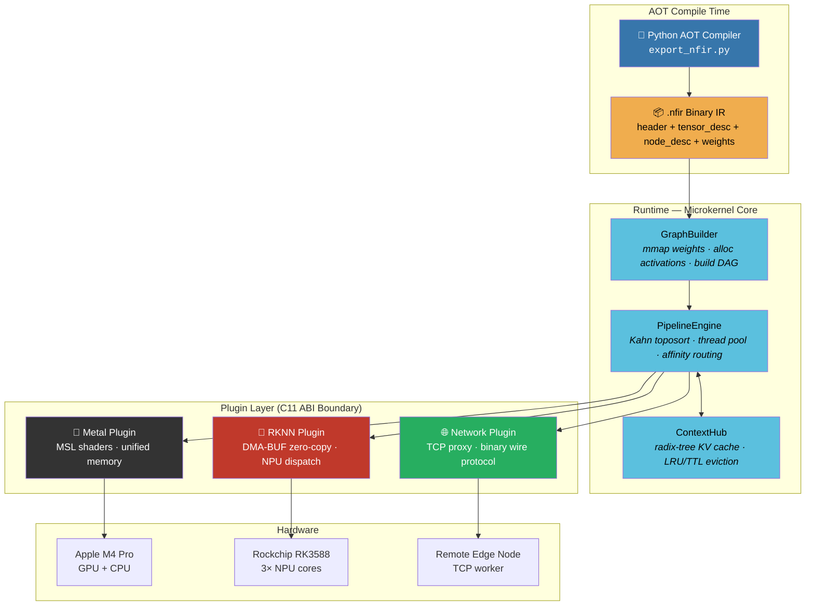

<p align="center">
  <h1 align="center">⚡️ NeuroFabric</h1>
  <p align="center">
    <strong>A Microkernel Heterogeneous Inference Framework for Edge AI</strong><br/>
    <em>Zero-vptr ABI · True Zero-Copy DMA-BUF · DAG Scheduling · Distributed Edge-Cloud</em>
  </p>
</p>

<p align="center">
  
  
  
  
  
  
  
  
</p>

<p align="center">
  <strong>English</strong> | <a href="README_CN.md">中文</a>
</p>

---

## Why NeuroFabric?

Most inference frameworks treat the runtime as a monolith — tightly coupled to one vendor SDK, one memory model, one execution topology. NeuroFabric takes the opposite approach: a **microkernel** that owns nothing but the scheduling contract, while all compute, memory, and transport are delegated to **dynamically loaded plugins** communicating through a **zero-vtable C11 ABI boundary**.

The result: the same binary orchestrates Apple Metal GPU shaders on a Mac and Rockchip NPU DMA-BUF zero-copy inference on an RK3588 — or both simultaneously over TCP, with the DAG scheduler routing sub-graphs to the optimal accelerator.

---

## Core Design Philosophy

### 🔩 Zero-vptr Hourglass ABI

Every cross-boundary call goes through **plain C function pointer tables** — no vtables, no RTTI, no `dynamic_cast`. Core exports **zero symbols**. Plugins fill a `nf_provider_vtable` struct at load time. ABI version gating rejects incompatible plugins before a single byte is dispatched. This means you can swap out the RKNN plugin for a TensorRT plugin without recompiling the scheduler, the memory manager, or any other plugin.

### 🧠 Data-Driven Execution via `.nfir` IR

Models are compiled offline into a compact binary IR (`.nfir`) by a Python AOT compiler. The C++ runtime never hardcodes tensor shapes, op names, or graph topology — it simply `mmap`s the weight payload (64B SIMD-aligned, 4KB page-aligned) and walks the node descriptors. Adding a new model is one Python call. Zero C++ changes. Zero recompilation.

### ⚡ True Zero-Copy Memory Paths

On RK3588: `rknn_create_mem()` → CMA DMA-BUF fd → `rknn_set_io_mem()` → NPU reads directly from CMA. No `memcpy`. On Apple Silicon: unified memory means the GPU sees the same virtual address as the CPU. The buffer abstraction (`nf_buffer_ops`) hides this behind a single `map`/`unmap`/`cache_sync` interface with explicit dirty tracking (`cpu_dirty` / `dev_dirty` flags).

**Measured**: YOLOv5s on RK3588 NPU — **23.12ms** zero-copy vs 63.48ms with copies (**2.7× speedup**).

### 🌐 Distributed DAG Scheduling

Any node in the compute graph can be tagged `NF_TASK_REMOTE`. The scheduler transparently routes it over TCP to a remote worker (e.g., Mac coordinator → Rock 5B+ edge NPU). The wire protocol is a minimal binary frame (40B header + per-tensor descriptors + raw payload in 256KB chunks, CRC32C integrity). No Protobuf. No gRPC. Just raw sockets and deterministic framing.

---

## Architecture



### Memory Architecture

```
┌─────────────────────────────────────────────────────────┐
│                   nf_buffer (opaque handle)              │
│                   nf_buffer_ops (C fn-ptr vtable)        │
├──────────┬──────────┬──────────┬──────────┬─────────────┤
│   CPU    │ Unified  │ DMA-BUF  │  MMAP    │  External   │
│ malloc() │ Apple    │ RK3588   │ weights  │ Vulkan/EGL  │
│          │ coherent │ CMA fd   │ read-only│             │
├──────────┴──────────┴──────────┴──────────┴─────────────┤
│  cache_sync: flush (CPU→dev) / invalidate (dev→CPU)     │
│  Apple: no-op (HW coherent)  RK3588: DMA_BUF_IOCTL_SYNC│
└─────────────────────────────────────────────────────────┘
```

---

## Build & Install

### Prerequisites

| Platform | Toolchain | SDK |
|----------|-----------|-----|
| macOS (Apple Silicon) | Xcode CLT / clang 15+ | Metal (system) |
| Rock 5B+ (RK3588) | GCC 12+ / aarch64 | [RKNN Toolkit2](https://github.com/airockchip/rknn-toolkit2) `librknnrt.so` + `rknn_api.h` |
| Linux x86_64 | GCC 12+ / clang 15+ | (simulation mode, no accelerator) |

### Option A: Apple Silicon (macOS)

```bash
git clone https://github.com/anthropics/neurofabric.git
cd neurofabric

# Metal plugin auto-detected on arm64 macOS
cmake -B build -DCMAKE_BUILD_TYPE=Release
cmake --build build -j$(sysctl -n hw.ncpu)
ctest --test-dir build --output-on-failure    # 8/8 green
```

### Option B: Rock 5B+ (RK3588) — Native Build

```bash
# On the Rock 5B+ itself (Debian/Ubuntu aarch64)
# Ensure RKNN runtime is installed:
#   /usr/lib/librknnrt.so
#   /usr/include/rknn_api.h

cmake -B build \
  -DCMAKE_BUILD_TYPE=Release \
  -DNF_PLUGIN_RKNN=ON
cmake --build build -j$(nproc)
ctest --test-dir build --output-on-failure    # 8/8 green
```

### Option C: Cross-Compile for RK3588 (from x86_64 host)

```bash
cmake -B build \
  -DCMAKE_TOOLCHAIN_FILE=/path/to/aarch64-linux-gnu.cmake \
  -DCMAKE_BUILD_TYPE=Release \
  -DNF_PLUGIN_RKNN=ON \
  -DRKNN_RT=/path/to/librknnrt.so
cmake --build build -j$(nproc)
```

### Build Options

| Option | Default | Description |
|--------|---------|-------------|
| `NF_BUILD_TESTS` | `ON` | Build unit tests |
| `NF_BUILD_TOOLS` | `ON` | Build `nf_node_cli` |
| `NF_PLUGIN_METAL` | Auto | Apple Silicon → ON |
| `NF_PLUGIN_RKNN` | Auto | Linux aarch64 → ON |
| `NF_PLUGIN_NETWORK` | `ON` | TCP distributed transport |

---

## Quick Start

### 1. Compile a model to `.nfir`

```python
from nf_compiler.export_nfir import NfirBuilder, NF_DTYPE_F32, NF_IR_USAGE_WEIGHT, NF_IR_USAGE_ACTIVATION
import numpy as np

builder = NfirBuilder()
weights = np.random.randn(1, 3, 640, 640).astype(np.float32)

builder.add_tensor(0, NF_DTYPE_F32, weights.shape, NF_IR_USAGE_WEIGHT, weight_data=weights)
builder.add_tensor(1, NF_DTYPE_F32, (1, 3, 640, 640), NF_IR_USAGE_ACTIVATION)
builder.add_tensor(2, NF_DTYPE_F32, (1, 80, 8400), NF_IR_USAGE_ACTIVATION)
builder.add_node(0, "yolov5_detect", [0, 1], [2])
builder.build("yolov5s.nfir")
```

### 2. Run locally

```bash
./build/bin/nf_node_cli --mode=local --nfir=yolov5s.nfir
```

### 3. Distributed: coordinator + edge worker

```bash
# On Rock 5B+ (edge NPU worker):
./nf_node_cli --mode=worker --port=9999

# On Mac (coordinator):
./nf_node_cli --mode=coord --nfir=model.nfir --remote=192.168.1.70:9999
```

### 4. C++ API (programmatic)

```cpp
#include <neurofabric/PipelineEngine.hpp>
#include <neurofabric/GraphBuilder.hpp>

nf::PipelineEngine engine;

// Register provider (loaded from plugin)
engine.register_provider(provider, vtable, NF_AFFINITY_NPU);

// Load .nfir → build DAG → execute
nf::GraphBuilder builder(engine, my_alloc_fn);
builder.load("model.nfir");

uint32_t graph_id;
builder.build(&graph_id);

auto future = engine.submit(graph_id);
nf_status result = future.get();  // blocks until DAG completes
```

---

## Performance

| Model | Platform | Backend | Resolution | Latency | Memory Path |
|-------|----------|---------|------------|---------|-------------|
| YOLOv5s | Rock 5B+ (RK3588) | NPU × 3 cores | 640×640 | **23.12 ms** | Zero-Copy DMA-BUF |
| YOLOv5s | Rock 5B+ (RK3588) | NPU (copy-based) | 640×640 | 63.48 ms | memcpy fallback |
| vector_add (1M) | Mac M4 Pro | Metal GPU | — | < 0.5 ms | Unified Memory |
| attention_prefill | Mac M4 Pro | Metal GPU | 128 tokens | < 1 ms | Unified Memory |
| NFIR E2E (1024 floats) | Both | CPU mock | — | < 1 ms | mmap weights |

> Zero-copy DMA-BUF delivers **2.7× speedup** over copy-based dispatch on identical hardware and model.

---

## Test Suite

All 8 tests pass on both macOS (M4 Pro) and Linux (Rock 5B+ RK3588) with zero warnings:

| Test | What It Validates |
|------|-------------------|
| `nf_smoke_test` | Plugin load/unload, ABI version gating |
| `nf_buffer_test` | Buffer alloc/map/unmap, cache coherency ops |
| `nf_scheduler_test` | DAG topological sort, work-stealing, affinity routing |
| `nf_e2e_pipeline_test` | Full DAG + TCP loopback, bit-exact verification |
| `nf_split_inference_test` | Metal prefill → TCP → decode, KV-cache handoff |
| `nf_ir_loader_test` | `.nfir` generation, mmap weights, DAG execution |
| `nf_silicon_test` | Real Metal GPU: vector_add + attention kernels |
| `nf_rknn_silicon_test` | Real NPU: zero-copy DMA-BUF + YOLOv5s inference |
| `nf_nfir_e2e_test` | `.nfir` → GraphBuilder → PipelineEngine → verify |

```bash
ctest --test-dir build --output-on-failure
```

---

## Project Structure

```
neurofabric/
├── core/
│   ├── include/neurofabric/
│   │   ├── neuro_fabric_abi.h          # Opaque handles, status codes, provider vtable
│   │   ├── neuro_buffer_abi.h          # Buffer ops, cache coherency, tensor descriptors
│   │   ├── neuro_scheduler_abi.h       # DAG task graph, scheduler vtable, affinity
│   │   ├── neuro_network_protocol.h    # Wire protocol, layout tags, CRC32C framing
│   │   ├── neuro_ir_format.h           # .nfir binary IR format (40B header + descriptors)
│   │   ├── PipelineEngine.hpp          # Kahn toposort DAG scheduler + thread pool
│   │   ├── ContextHub.hpp              # Radix-tree prefix-match KV-cache
│   │   ├── TensorView.hpp             # C++20 RAII tensor wrapper
│   │   └── GraphBuilder.hpp            # IR-driven DAG builder
│   └── src/
│       ├── plugin_loader.cpp           # dlopen + ABI version gate
│       ├── platform/                   # dl_posix.cpp, dl_win32.cpp
│       └── graph/                      # GraphBuilder.cpp, mmap_buffer.cpp
├── plugins/
│   ├── metal/src/metal_provider.mm     # Apple Metal GPU (MSL shaders, unified mem)
│   ├── rknn/src/rknn_provider.cpp      # RK3588 NPU (DMA-BUF zero-copy, sub-graph closure)
│   └── network/src/                    # TCP proxy (256KB chunked, CRC32C)
├── tools/
│   ├── nf_node_cli.cpp                 # Universal CLI: local / coord / worker
│   └── nf_compiler/
│       ├── export_nfir.py              # Python AOT compiler (stdlib + numpy)
│       └── test_export.py              # Compiler unit tests (6/6)
└── tests/                              # 8 integration + unit tests
```

---

## Roadmap

- [ ] **INT8 Quantization Pipeline** — Calibration dataset → per-channel scale/zp → RKNN INT8 model export
- [ ] **Multi-Worker Load Balancing** — Latency-aware routing with heartbeat-based health checks
- [ ] **Profiling & Tracing** — Per-op timing, memory watermark heatmaps, Chrome `trace_event` export
- [ ] **Dynamic Batching** — Request coalescing with configurable max-wait / max-batch-size
- [ ] **Vulkan Compute Plugin** — SPIR-V shader dispatch for Android / Linux desktop GPUs
- [ ] **ONNX → .nfir Frontend** — Direct ONNX graph import in the AOT compiler, op fusion passes

---

## Design Decisions & Gotchas

<details>
<summary>Click to expand — notes for contributors</summary>

- **Cross-dylib bridge**: Plugins recover `nf_task_desc` from buffer pointer via `offsetof(nf_task_desc, inputs)`. Don't reorder that struct.
- **RKNN naming**: SDK exports `rknn_init` — our provider uses `rknn_prov_init` / `rknn_prov_shutdown` to avoid collision.
- **DMA-BUF lifecycle**: `rknn_destroy_mem` on `FROM_FD` mem only frees the wrapper struct, not the fd/VA. The allocating context owns the fd.
- **Zero-copy enforcement**: If any IO buffer lacks `sdk_mem`, dispatch triggers `FATAL` — no silent fallback to copies.
- **macOS page size**: arm64 macOS uses 16KB pages. mmap offsets must align to `sysconf(_SC_PAGESIZE)`, not hardcoded 4KB.
- **Linux sockets**: `signal(SIGPIPE, SIG_IGN)` + `MSG_NOSIGNAL` on every `send()` — otherwise a broken pipe kills the process.
- **C/C++ dual headers**: Use `static_assert` in C++, `_Static_assert` in C (GCC 12 compat). Guarded by `__cplusplus`.
- **Release builds**: Tests use `CHECK()` macro, not `assert()` — `NDEBUG` strips `assert` in Release mode.

</details>

---

## License

This project is licensed under the [Apache License 2.0](LICENSE).

```
Copyright 2025 NeuroFabric Contributors

Licensed under the Apache License, Version 2.0 (the "License");
you may not use this file except in compliance with the License.
You may obtain a copy of the License at

    http://www.apache.org/licenses/LICENSE-2.0

Unless required by applicable law or agreed to in writing, software
distributed under the License is distributed on an "AS IS" BASIS,
WITHOUT WARRANTIES OR CONDITIONS OF ANY KIND, either express or implied.
See the License for the specific language governing permissions and
limitations under the License.
```

---

<p align="center">
  <sub>Built with obsessive attention to memory layout, ABI stability, and the belief that inference frameworks should be measured in microseconds, not abstractions.</sub>
</p>