<p align="center">
  <h1 align="center">⚡️ NeuroFabric</h1>
  <p align="center">
    <strong>A Microkernel Heterogeneous LLM Inference Engine for Edge &amp; Cloud</strong><br/>
    <em>Zero-vptr Hourglass ABI · 50+ Metal GPU Kernels · PagedAttention · Speculative Decoding · Distributed DAG Scheduling</em>
  </p>
</p>

<p align="center">
  
  
  
  
  
  
  
  
  
</p>

<p align="center">
  <strong>English</strong> | <a href="README_CN.md">中文</a>
</p>

---

## Why NeuroFabric?

Most inference engines are monoliths — welded to one vendor SDK, one memory model, one execution topology. NeuroFabric is the opposite: a **microkernel** that owns nothing but the scheduling contract. All compute, memory, and transport are delegated to **dynamically loaded plugins** communicating through a **zero-vtable C11 ABI boundary**.

The same binary runs a 7B LLaMA on Apple Metal at ~45 tok/s (fused FP16), drives Rockchip NPU zero-copy inference on an RK3588, or splits a DAG across both over TCP — with the scheduler routing sub-graphs to the optimal accelerator automatically.

**What ships today (Phase 32):**

- Full autoregressive LLM inference: LLaMA, Mistral, Phi-3 architectures from GGUF
- 53 Metal compute kernels (FP32 + FP16 + fused dequant×matmul)
- 10 quantization formats (Q4_0 through Q6_K) with FP16 dequant variants
- PagedAttention with O(1) block allocation, 64 concurrent sequences
- Continuous batching request scheduler with preemption
- Speculative decoding framework (draft/verify with KV rollback)
- BPE tokenizer, temperature/top-k/top-p sampling, streaming output
- Python ctypes binding (zero-dependency)
- Distributed edge-cloud DAG scheduling over TCP

---

## Core Design Philosophy

### 🔩 Zero-vptr Hourglass ABI

Every cross-boundary call goes through **plain C function pointer tables** — no vtables, no RTTI, no `dynamic_cast`. Core exports **zero symbols**. Plugins fill a `nf_provider_vtable` struct at load time. ABI version gating (`0x000100`, `static_assert`-guarded 3056-byte `nf_task_desc`) rejects incompatible plugins before a single byte is dispatched.

```
C++20 (core internals)  →  C11 ABI waist  →  C++20 (plugin internals)
PipelineEngine              neuro_fabric_abi.h      metal_provider.mm
ContextHub                  neuro_buffer_abi.h      rknn_provider.cpp
TensorView                  neuro_scheduler_abi.h   network_provider.cpp
```

### 🧠 DAG-Driven Execution Engine

The `PipelineEngine` implements Kahn's topological sort with O(V+E) complexity and a fixed-size thread pool. `Session` objects cache the initial in-degree vector — `step()` resets and dispatches without re-sorting. The LLaMA DAG builder constructs a two-phase graph per model:

- **Phase 1 (Warmup):** Dequantize all weights once into GPU-resident buffers
- **Phase 2 (Per-token):** Attention + FFN inference with shared activation buffers

Any node can be tagged `NF_TASK_REMOTE` for transparent TCP routing to edge workers.

### ⚡ True Zero-Copy Memory Paths

On RK3588: `rknn_create_mem()` → CMA DMA-BUF fd → `rknn_set_io_mem()` → NPU reads directly from CMA. No `memcpy`. On Apple Silicon: unified memory means the GPU sees the same virtual address as the CPU. The buffer abstraction (`nf_buffer_ops`) hides this behind a single `map`/`unmap`/`cache_sync` interface with explicit dirty tracking.

Six memory domains: `CPU`, `UNIFIED` (Apple coherent), `DMA_BUF` (RK3588 CMA), `DEVICE` (VRAM), `MMAP` (read-only weights), `EXTERNAL` (Vulkan/EGL import).

### 🔥 Production LLM Inference Stack

From GGUF file to streaming tokens in one command:

```bash
./nf_generate tinyllama-1.1b-chat.Q4_0.gguf "Hello, world" --fp16 --paged --max-tokens 128
```

The stack: GGUF v2/v3 parser → multi-arch DAG builder (strategy pattern) → PSO hash registry (O(1) kernel dispatch) → fused dequant×matmul → flash attention with paged KV cache → BPE tokenizer → temperature/top-k/top-p sampling.

---

## Architecture

```mermaid
graph TB
    subgraph "Model Ingestion"
        GGUF["📦 GGUF v2/v3<br/>LLaMA · Mistral · Phi-3"]
        NFIR["📦 .nfir Binary IR<br/>AOT-compiled models"]
    end

    subgraph "Runtime — Microkernel Core"
        LOADER["GGUFLoader + ArchRegistry<br/><i>strategy pattern · auto-detect arch</i>"]
        DAG["LlamaDAGBuilder<br/><i>2-phase graph · fused ops · paged KV</i>"]
        PE["PipelineEngine<br/><i>Kahn toposort · thread pool · affinity routing</i>"]
        CH["ContextHub<br/><i>radix-tree KV cache · LRU/sliding/paged eviction</i>"]
        SCHED["RequestScheduler<br/><i>continuous batching · preemption · token budget</i>"]
        GGUF --> LOADER --> DAG --> PE
        NFIR --> PE
        PE <--> CH
        PE <--> SCHED
    end

    subgraph "Plugin Layer (C11 ABI Boundary)"
        MTL["🍎 Metal Plugin<br/>53 MSL kernels · PSO hash registry<br/>FP16 pipeline · fused dequant×matmul"]
        RKNN["🔴 RKNN Plugin<br/>DMA-BUF zero-copy · NPU dispatch"]
        NET["🌐 Network Plugin<br/>TCP proxy · binary wire protocol · CRC32C"]
    end

    PE --> MTL
    PE --> RKNN
    PE --> NET

    subgraph "Hardware"
        M4["Apple M-series<br/>Metal GPU + unified memory"]
        RK["Rockchip RK3588<br/>3× NPU cores + CMA"]
        EDGE["Remote Edge Node<br/>TCP worker"]
    end

    MTL --> M4
    RKNN --> RK
    NET --> EDGE

    style GGUF fill:#f0ad4e,color:#000
    style NFIR fill:#f0ad4e,color:#000
    style LOADER fill:#5bc0de,color:#000
    style DAG fill:#5bc0de,color:#000
    style PE fill:#5bc0de,color:#000
    style CH fill:#5bc0de,color:#000
    style SCHED fill:#5bc0de,color:#000
    style MTL fill:#333,color:#fff
    style RKNN fill:#c0392b,color:#fff
    style NET fill:#27ae60,color:#fff
```



### Memory Architecture

```
┌─────────────────────────────────────────────────────────┐
│                   nf_buffer (opaque handle)              │
│                   nf_buffer_ops (C fn-ptr vtable)        │
├──────────┬──────────┬──────────┬──────────┬─────────────┤
│   CPU    │ Unified  │ DMA-BUF  │  MMAP    │  External   │
│ malloc() │ Apple    │ RK3588   │ weights  │ Vulkan/EGL  │
│          │ coherent │ CMA fd   │ read-only│             │
├──────────┴──────────┴──────────┴──────────┴─────────────┤
│  cache_sync: flush (CPU→dev) / invalidate (dev→CPU)     │
│  Apple: no-op (HW coherent)  RK3588: DMA_BUF_IOCTL_SYNC│
└─────────────────────────────────────────────────────────┘
```

### ABI Layer Stack

```
Layer 4: nf_c_api.h              Pure C FFI surface (Python ctypes, other languages)
Layer 3: neuro_scheduler_abi.h   DAG task graph, async futures, ContextHub, eviction policies
Layer 2: neuro_buffer_abi.h      Buffer ops, zero-copy, cache coherency, 6 memory domains
Layer 1: neuro_fabric_abi.h      Provider vtable, opaque handles, dtype enum (16 types), status codes
```

---

## Build & Install

### Prerequisites

| Platform | Toolchain | SDK / Runtime |
|----------|-----------|---------------|
| macOS (Apple Silicon) | Xcode CLT / clang 15+ | Metal (system, auto-detected) |
| Rock 5B+ (RK3588) | GCC 12+ / aarch64 | [RKNN Toolkit2](https://github.com/airockchip/rknn-toolkit2) `librknnrt.so` + `rknn_api.h` |
| Linux x86_64 | GCC 12+ / clang 15+ | CPU-only simulation mode |

### Option A: Apple Silicon (macOS)

```bash
git clone https://github.com/anthropics/neurofabric.git && cd neurofabric

# Metal plugin auto-detected on arm64 macOS
cmake -B build -DCMAKE_BUILD_TYPE=Release
cmake --build build -j$(sysctl -n hw.ncpu)

# Verify — 39 tests
ctest --test-dir build --output-on-failure
```

### Option B: Rock 5B+ (RK3588) — Native Build

```bash
# On the Rock 5B+ itself (Debian/Ubuntu aarch64)
# Ensure RKNN runtime is installed:
#   /usr/lib/librknnrt.so
#   /usr/include/rknn_api.h

cmake -B build -DCMAKE_BUILD_TYPE=Release -DNF_PLUGIN_RKNN=ON
cmake --build build -j$(nproc)
ctest --test-dir build --output-on-failure
```

### Option C: Cross-Compile for RK3588

```bash
cmake -B build \
  -DCMAKE_TOOLCHAIN_FILE=/path/to/aarch64-linux-gnu.cmake \
  -DCMAKE_BUILD_TYPE=Release \
  -DNF_PLUGIN_RKNN=ON \
  -DRKNN_RT=/path/to/librknnrt.so
cmake --build build -j$(nproc)
```

### Build Options

| Option | Default | Description |
|--------|---------|-------------|
| `NF_BUILD_TESTS` | `ON` | Build 39 unit/integration tests |
| `NF_BUILD_TOOLS` | `ON` | Build `nf_node_cli`, `nf_generate` |
| `NF_PLUGIN_METAL` | Auto | Apple Silicon → ON |
| `NF_PLUGIN_RKNN` | Auto | Linux aarch64 → ON |
| `NF_PLUGIN_NETWORK` | `ON` | TCP distributed transport |
| `NF_BUILD_EXAMPLES` | `ON` | Example programs |

---

## Quick Start

### 1. Text Generation (LLM)

```bash
# Download a GGUF model (any LLaMA/Mistral/Phi-3 compatible)
# Then generate:
./build/bin/nf_generate ./models/tinyllama-1.1b-chat.Q4_0.gguf \
    "The meaning of life is" \
    --max-tokens 64 --temperature 0.8 --top-k 40 --fp16 --paged
```

### 2. Distributed Inference (Edge-Cloud)

```bash
# On Rock 5B+ (edge NPU worker):
./nf_node_cli --mode=worker --port=9999

# On Mac (coordinator):
./nf_node_cli --mode=coord --nfir=model.nfir --remote=192.168.1.70:9999
```

### 3. Python Binding

```python
from neurofabric import Engine, Session

engine = Engine(n_threads=4)
session = Session(engine, "model.nfir")
session.step()
print(f"Latency: {session.last_step_us():.1f} µs")
```

### 4. C++ API

```cpp
#include <neurofabric/PipelineEngine.hpp>
#include "gguf_loader.hpp"
#include "llama_dag_builder.hpp"

// Load GGUF model
auto* model = nf::gguf_open("llama-7b.Q4_0.gguf");

// Init Metal provider
nf_provider prov; nf_provider_vtable vt; nf_provider_mem_vtable mem_vt;
nf_plugin_register(&vt, &prov);
nf_plugin_register_mem(&mem_vt, &prov);
vt.init(prov);

// Build engine + DAG
nf::PipelineEngine engine(4);
engine.register_provider(prov, vt, NF_AFFINITY_GPU);

nf::ModelConfig cfg{};
cfg.engine = &engine;  cfg.prov = prov;
cfg.vt = &vt;  cfg.mem_vt = &mem_vt;  cfg.model = model;
cfg.use_fp16 = true;  cfg.use_paged_kv = true;

auto ctx = nf::create_llama_context(cfg);

// Autoregressive decode loop
auto sg = nf::build_llama_step_graph(*ctx, /*seq_len=*/1);
nf::PipelineEngine::Session sess(engine, sg.gid);
nf::inject_step_push_constants(*ctx, sg, sess, 1, step_idx);
sess.step().get();  // blocks until DAG completes
```

---

## Performance

### LLM Inference (Apple Silicon M4 Pro)

| Model | Quant | Backend | Decode (tok/s) | TTFT | Memory |
|-------|-------|---------|---------------|------|--------|
| TinyLlama 1.1B | Q4_0 | Metal FP32 | ~17.0 | ~80ms | 637 MB |
| TinyLlama 1.1B | Q4_0 | Metal FP16 | ~34.0 | ~50ms | 637 MB |
| Mistral 7B | Q4_0 | Metal FP32 | ~8.2 | ~200ms | 4.1 GB |
| Mistral 7B | Q4_0 | Metal FP16 | ~16.0 | ~150ms | 4.1 GB |
| LLaMA 7B | Q4_0 | Metal FP16 + Fused | ~45.0 | ~150ms | 4.1 GB |

### GPU Kernel Breakdown (7B model)

| Kernel | Time % | Notes |
|--------|--------|-------|
| `linear_tiled` / `linear_simd` | 81.6% | Matmul dominates |
| `rms_norm` | 10.6% | Per-layer normalization |
| `flash_attention_tiled` | 2.3% | Tiled flash attention |
| `rope_batch` | 1.8% | Rotary position encoding |
| Other (silu, elementwise, embed, argmax) | 3.7% | |

### Edge Inference (RK3588)

| Model | Platform | Backend | Latency | Memory Path |
|-------|----------|---------|---------|-------------|
| YOLOv5s | Rock 5B+ | NPU × 3 cores | **23.12 ms** | Zero-Copy DMA-BUF |
| YOLOv5s | Rock 5B+ | NPU (copy-based) | 63.48 ms | memcpy fallback |

### Continuous Batching

| Metric | Value |
|--------|-------|
| Max concurrent sequences | 64 |
| KV block size | 16 tokens |
| Max blocks per sequence | 512 (8192 tokens) |
| Block allocation | O(1) LIFO stack |
| PSO kernel dispatch | O(1) hash lookup |

---

## Metal Kernel Inventory (53 PSOs)

<details>
<summary>Click to expand full kernel table</summary>

| Category | Kernels | Phase |
|----------|---------|-------|
| **Core MatMul** | `linear`, `linear_tiled`, `linear_simd` | 8–24 |
| **FP16 Compute** | `rms_norm_f16`, `rope_batch_f16`, `linear_simd_f16`, `linear_tiled_f16`, `linear_f16_to_f32`, `flash_attention_tiled_f16`, `silu_f16`, `elementwise_mul_f16`, `metal_vector_add_f16`, `embedding_lookup_f16` | 27 |
| **Attention** | `causal_attention`, `causal_attention_cached`, `flash_attention_tiled`, `flash_attention_paged` | 17–32 |
| **Normalization** | `rms_norm`, `rms_norm_f16` | 17–27 |
| **Position Encoding** | `rope`, `rope_batch`, `rope_batch_f16` | 17–27 |
| **Dequant (FP32)** | `dequant_q4_0`, `q8_0`, `q6_k`, `q4_1`, `q5_0`, `q5_1`, `q2_k`, `q3_k`, `q4_k`, `q5_k` | 9–25 |
| **Dequant (FP16)** | All 10 above with `_f16` suffix | 27 |
| **Fused Ops** | `dequant_q4_0_linear_tiled`, `dequant_q4_0_linear_tiled_f16` | 29 |
| **Activation** | `softmax`, `silu`, `elementwise_mul`, `relu`, `vector_add` | 9–17 |
| **Embedding/Output** | `embedding_lookup`, `embedding_lookup_f16`, `argmax_rows` | 17–27 |
| **Prefill** | `attention_prefill_k`, `attention_prefill_v` | 17 |

</details>

---

## Quantization Support

| Format | Bytes/Block | Elements/Block | Structure |
|--------|-------------|----------------|-----------|
| Q4_0 | 18 | 32 | 2B scale + 16B nibbles |
| Q4_1 | 20 | 32 | 2B scale + 2B min + 16B nibbles |
| Q5_0 | 22 | 32 | 2B scale + 4B high-bits + 16B nibbles |
| Q5_1 | 24 | 32 | 2B scale + 2B min + 4B high-bits + 16B nibbles |
| Q8_0 | 34 | 32 | 2B scale + 32B quants |
| Q2_K | 84 | 256 | Superblock: per-block scales + mins |
| Q3_K | 110 | 256 | Superblock: per-block scales + mins |
| Q4_K | 144 | 256 | Superblock: 8-element sub-blocks |
| Q5_K | 176 | 256 | Superblock: 8-element sub-blocks |
| Q6_K | 210 | 256 | Superblock: per-block scales |

All formats have both FP32 and FP16 dequantization kernels. Q4_0 additionally has fused dequant×matmul kernels.

---

## Multi-Architecture Support

NeuroFabric uses a **strategy pattern** for architecture-specific behavior. Each architecture registers its own weight naming, attention, RoPE, FFN, and normalization strategies:

| Feature | LLaMA | Mistral | Phi-3 |
|---------|-------|---------|-------|
| Attention | Full causal | Sliding window | Full causal |
| RoPE | Full-dim | Full-dim | Partial-dim |
| FFN Activation | SiLU | SiLU | GELU |
| Normalization | RMS Norm | RMS Norm | Layer Norm |
| KV Eviction | None / Paged | Sliding window | None / Paged |

Architecture is auto-detected from GGUF metadata, or overridden with `--arch`:

```bash
./nf_generate model.gguf "prompt" --arch mistral --fp16
```

---

## Project Structure

```
neurofabric/                              26,711 LOC · 80+ files · 39 tests
├── core/
│   ├── include/neurofabric/
│   │   ├── neuro_fabric_abi.h            Layer 1: provider vtable, opaque handles
│   │   ├── neuro_buffer_abi.h            Layer 2: buffer ops, zero-copy, 6 memory domains
│   │   ├── neuro_scheduler_abi.h         Layer 3: DAG tasks, futures, ContextHub
│   │   ├── nf_c_api.h                    Layer 4: pure C FFI for Python
│   │   ├── PipelineEngine.hpp            Kahn toposort, thread pool, Session
│   │   ├── ContextHub.hpp                Radix-tree KV cache, shared_mutex
│   │   ├── TensorView.hpp               C++20 RAII tensor wrapper
│   │   ├── ProfileTrace.hpp             Per-kernel GPU profiling
│   │   └── GraphBuilder.hpp             .nfir → DAG construction
│   └── src/                              API impl, graph builder, platform loaders
├── plugins/
│   ├── metal/src/
│   │   ├── metal_provider.mm             2,707 LOC — 53 MSL kernels, PSO registry
│   │   └── metal_pso_registry.h          Enum-indexed PSO table
│   ├── rknn/src/rknn_provider.cpp        DMA-BUF zero-copy NPU dispatch
│   └── network/src/                      TCP proxy, binary wire protocol
├── tools/
│   ├── nf_generate.cpp                   End-to-end text generation CLI
│   ├── nf_node_cli.cpp                   Coordinator/worker/local CLI
│   ├── llama_dag_builder.hpp             1,694 LOC — multi-arch DAG construction
│   ├── model_config.hpp                  ModelConfig, PagedKVCache, RequestScheduler
│   ├── kv_cache_policy.hpp               None/Sliding/LRU/Paged eviction + INT8 KV
│   ├── arch_registry.hpp                 Strategy pattern for LLaMA/Mistral/Phi-3
│   ├── gguf_loader.hpp                   GGUF v2/v3 parser, mmap weights
│   ├── tokenizer.hpp                     BPE tokenizer (byte-fallback)
│   ├── sampler.hpp                       Temperature / top-k / top-p / repeat penalty
│   └── nf_compiler/export_nfir.py        Python AOT compiler
├── python/
│   ├── neurofabric.py                    Zero-dependency ctypes binding
│   └── autoregressive_inference.py       Python inference example
├── tests/                                39 test files, 12,741 LOC
└── docs/
    └── ARCHITECTURE.md                   Full architecture document (Chinese)
```

---

## Evolution Roadmap

NeuroFabric has evolved through 32 phases. Here's where it's headed:

| Phase | Direction | Description |
|-------|-----------|-------------|
| **Done** | Phases 1–32 | Hourglass ABI → DAG engine → Metal/RKNN/Network plugins → GGUF ingestion → multi-layer Transformer → SIMD matmul → K-quant → 7B validation → FP16 pipeline → PSO registry → fused ops → sliding window → multi-arch → PagedAttention → continuous batching → speculative decoding |
| 33 | Tensor Parallelism | Multi-GPU weight sharding across Metal devices |
| 34 | Pipeline Parallelism | Layer-level cross-device splitting |
| 35 | INT8 KV Cache | Quantized KV cache for 2× context length at same memory |
| 36 | ONNX Import | ONNX → DAG converter for vision/audio models |
| 37 | LoRA Adapters | Runtime low-rank adaptation hot-swap |
| 38 | Whole-Graph Compiler | End-to-end optimization: operator fusion, memory planning, scheduling |

---

## Internals & Design Invariants

<details>
<summary>Click to expand — notes for contributors</summary>

- **Zero-export core**: `GraphBuilder` and `mmap_buffer` are compiled into test/CLI binaries, NOT exported from the core library.
- **`nf_task_desc` is 3056 bytes**: `static_assert` in both C++ and C guards the layout. Changing it breaks the ABI.
- **ContextHub keys are `int32_t` token-IDs**, not strings. Compressed radix tree with `shared_mutex` for read-write separation.
- **Session caches `initial_in_degrees_`**: `step()` resets without re-scanning or re-sorting the DAG.
- **PSO lazy compilation**: First use triggers MSL→PSO compilation. Thread-safe. `requires_simd` flag gates GPU Family 7+ kernels.
- **Fused op detection**: DAG builder scans for dequant→matmul pairs and merges them into single dispatch nodes. Falls back gracefully if fusion is unavailable.
- **RKNN name collision**: SDK exports `rknn_init` — our provider uses `rknn_prov_init` / `rknn_prov_shutdown`.
- **DMA-BUF lifecycle**: `rknn_destroy_mem` on `FROM_FD` mem only frees the wrapper, not the fd/VA. The allocating context owns the fd.
- **Zero-copy enforcement**: If any IO buffer lacks `sdk_mem`, dispatch triggers `FATAL` — no silent fallback.
- **macOS page size**: arm64 macOS uses 16KB pages. mmap offsets align to `sysconf(_SC_PAGESIZE)`, not hardcoded 4KB.
- **Linux sockets**: `signal(SIGPIPE, SIG_IGN)` + `MSG_NOSIGNAL` on every `send()`.
- **C/C++ dual headers**: `static_assert` in C++, `_Static_assert` in C (GCC 12 compat). Guarded by `__cplusplus`.
- **Release builds**: Tests use `CHECK()` macro, not `assert()` — `NDEBUG` strips `assert`.
- **Metal init order**: `g_vt.init(g_prov)` before any buffer allocation.
- **argmax kernel**: `pc.N` for row width, `pc.seq_len` for row count (NOT `pc.head_dim`).
- **linear_tiled**: Bounds check AFTER tile loading; all threads must hit `threadgroup_barrier`.

</details>

---

## License

```
Copyright 2025 NeuroFabric Contributors

Licensed under the Apache License, Version 2.0 (the "License");
you may not use this file except in compliance with the License.
You may obtain a copy of the License at

    http://www.apache.org/licenses/LICENSE-2.0

Unless required by applicable law or agreed to in writing, software
distributed under the License is distributed on an "AS IS" BASIS,
WITHOUT WARRANTIES OR CONDITIONS OF ANY KIND, either express or implied.
See the License for the specific language governing permissions and
limitations under the License.
```

---

<p align="center">
  <sub>Built with obsessive attention to memory layout, ABI stability, and the belief that inference engines should be measured in microseconds, not abstractions.</sub>
</p>
